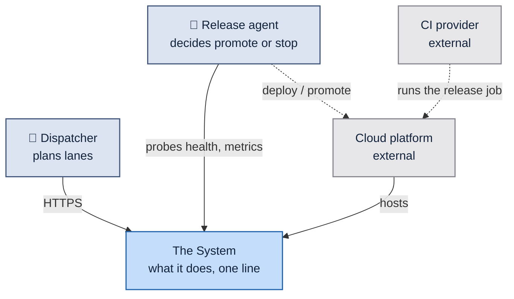
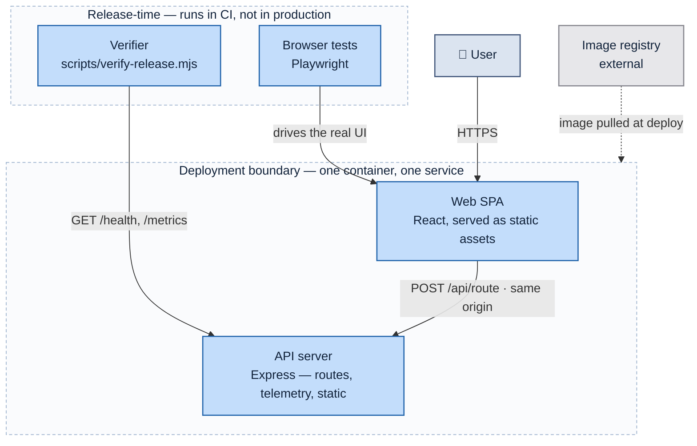
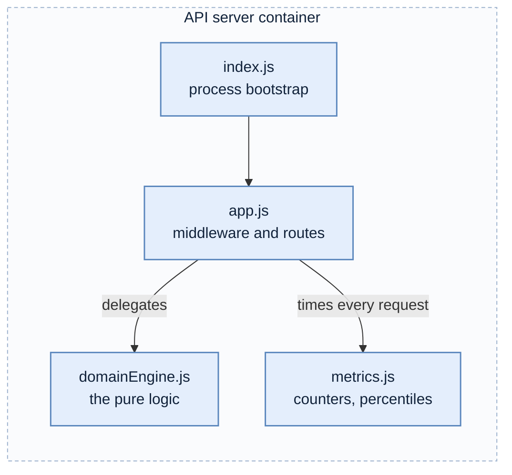
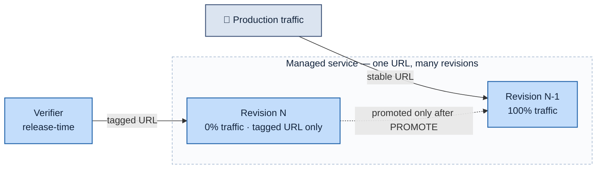
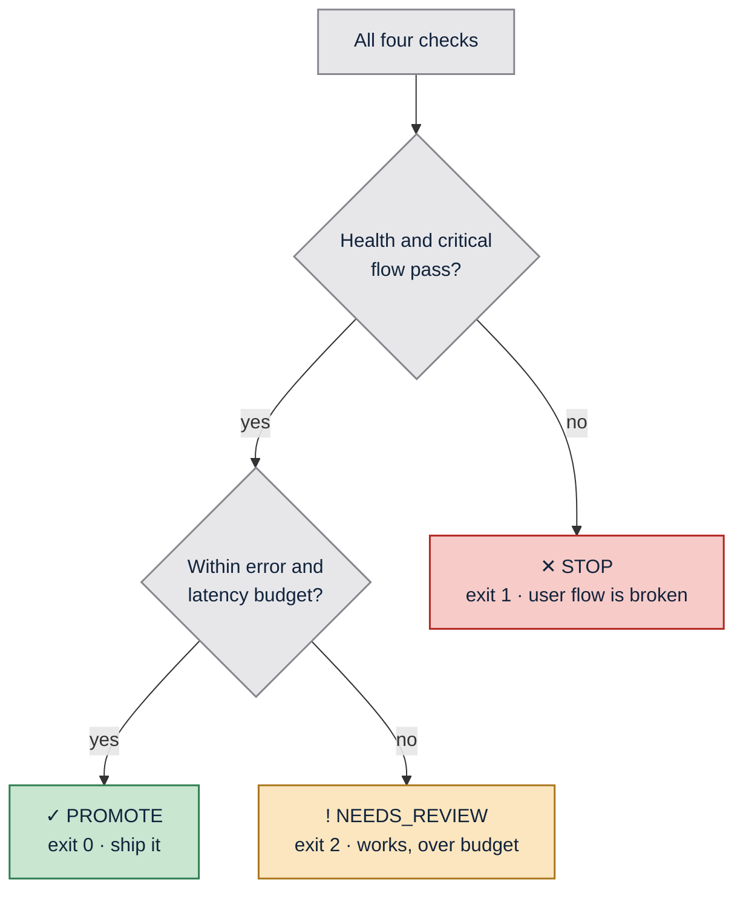
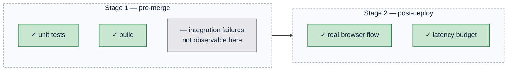

# Diagram recipes

Working Mermaid templates per C4 level, with the color contract inlined. Start
from these; do not compose diagrams from scratch.

## No HTML in labels — ever

Do not put ` `, `<b>`, `<i>`, ``, or any other tag inside a Mermaid
label. HTML in labels depends on the renderer running with `htmlLabels` enabled;
it is escaped and printed literally under strict security settings, and it does
not survive export to SVG-only pipelines. Diagrams must be portable.

Instead:

- **Line break** → `\n` inside the quoted label: `A["Web SPA\nReact 18"]`
- **Emphasis** → do not. A diagram label is not a place for typography. If a box
  needs to stand out, that is what the color classes are for; if it needs
  explanation, that is what the table under the diagram is for.
- **Leading glyph** → plain Unicode is fine: `A["✓ PASS"]`, `A["👤 Dispatcher"]`.

This is a hard rule, checked before any diagram is considered done.

## Other Mermaid syntax traps

- **Always quote labels**: `A["Text"]`, never `A[Text]`. Unquoted parentheses,
  `>`, `#`, `:` and `-` all break the parser at some point.
- **Arrow with a label**: `A -->|"reads /metrics"| B` — the pipe text needs
  quotes too if it contains anything but letters.
- **`classDef` goes at the bottom** of the block, `class` assignments after it.
- **Assign many nodes at once**: `class a,b,c owned` — no spaces after commas.
- **Subgraph ids must be bare**: `subgraph cr["Cloud Run"]`, and the closing
  `end` must be on its own line.
- **`→` and `·` render fine** inside quoted labels; `-->` inside a label does not.
- Avoid `linkStyle` indexing unless the edge order is stable — it silently
  colors the wrong edge after any edit.
- **Sibling subgraphs render in layout order, not declaration order.** If the
  order matters (it does for a legend), force it with an invisible link:
  `s ~~~ r`.

## C1 — System context

One box for the system. Everything else is an actor or an external system. No
internals. If you are tempted to draw a database here, you are at C2.

`_Legend S — hue = ownership. Solid = runtime request path; dashed = deploy-time action._`

## C2 — Containers

Independently deployable or independently running things. A browser SPA is a
container. A library is not.

`_Legend S — hue = ownership; saturation = altitude._`

## C3 — Components

Inside **one** container. Modules and their collaboration. Use `internal` (pale
blue) for every module — they are all inside something already `owned`, so the
saturated blue would over-claim.

`_Legend S — all modules are internal to one owned container._`

## Deployment / traffic topology

Draw this when traffic routing is a decision, not a given. Legend S for the
infrastructure; if a gate appears in the flow, give the gate its own diagram
under Legend R rather than mixing.

`_Legend S — hue = ownership._`

## Gate / verdict (Legend R)

The one place hue means outcome. Keep the exit codes in the labels so the
diagram and the shell agree.

The decision diamonds **must** be classed. Left unclassed they render in
Mermaid's default lavender — a fifth color with no meaning, in the one diagram
where color carries the most weight. `blind` is correct for them: a question
asserts no verdict.

`_Legend R — hue = verdict. Every node also carries its glyph and exit code._`

## Coverage / blind-spot diagram

The highest-value diagram in most repos: what each stage **cannot** see. Grey is
the payload here — it marks the gap that motivates everything else.

`_Legend R — green = caught at this stage; grey = structurally invisible to it._`

## The legend diagram itself

Put this near the top of the document so the key precedes its use.

```mermaid
flowchart LR
    subgraph s["Legend S — structural diagrams: hue = ownership"]
        direction LR
        sa["👤 actor"] --- so["we deploy it"] --- si["module inside it"] --- se["external"]
    end
    subgraph r["Legend R — gate diagrams: hue = outcome"]
        direction LR
        rp["✓ pass"] --- rw["! over budget"] --- rf["✕ fail"] --- rb["— not observable"]
    end
    s ~~~ r

    classDef actor    fill:#dbe4f0,stroke:#41567a,stroke-width:1.5px,color:#12233b
    classDef owned    fill:#c3ddfb,stroke:#2264ab,stroke-width:1.5px,color:#12233b
    classDef internal fill:#e4eefc,stroke:#5b87bd,stroke-width:1.5px,color:#12233b
    classDef external fill:#e7e7ea,stroke:#87878f,stroke-width:1.5px,color:#12233b
    classDef pass  fill:#c8e6d0,stroke:#2e7d4f,stroke-width:1.5px,color:#12233b
    classDef warn  fill:#fbe6bf,stroke:#a9761b,stroke-width:1.5px,color:#12233b
    classDef fail  fill:#f6cbc8,stroke:#b3261e,stroke-width:1.5px,color:#12233b
    classDef blind fill:#e7e7ea,stroke:#87878f,stroke-width:1.5px,color:#12233b
    classDef boundary fill:#fafbfd,stroke:#9db2cd,stroke-width:1px,stroke-dasharray:4 3,color:#12233b
    class sa actor
    class so owned
    class si internal
    class se external
    class rp pass
    class rw warn
    class rf fail
    class rb blind
    class s,r boundary
```

