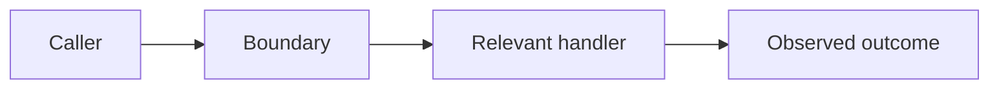
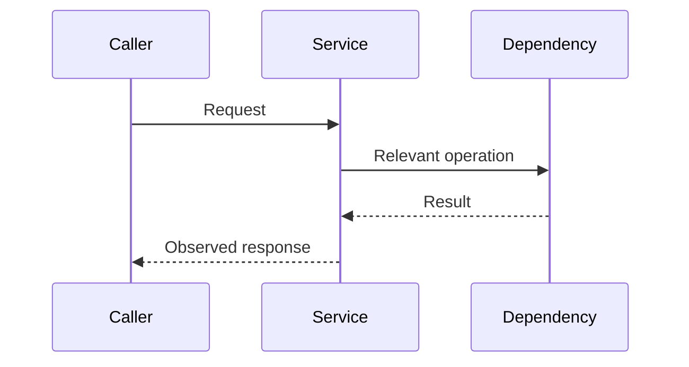

# Investigation: <short subject>

_Investigated: YYYY-MM-DD · Scope: <environment/revision/time window>_

## Conclusion

<What happens, confidence, and impact.>

## Evidence

| Observation | Source | What it establishes |
| --- | --- | --- |
| <fact> | `<path:line>` / <query or URL> | <meaning> |

## Trace



## Sequence



## Reproduce

Prerequisites: <revision, environment, permissions, fixture>

```bash
# <what this demonstrates>
<command>
```

Expected: <observable result>

## What seems amiss

- **Fact:** <evidence-backed behavior>
- **Inference (confidence: high|medium|low):** <suspected defect or gap>

## Next looks

- <Specific check, why it matters, and the permission/access/data/knowledge needed.>
