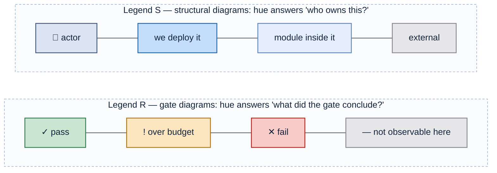
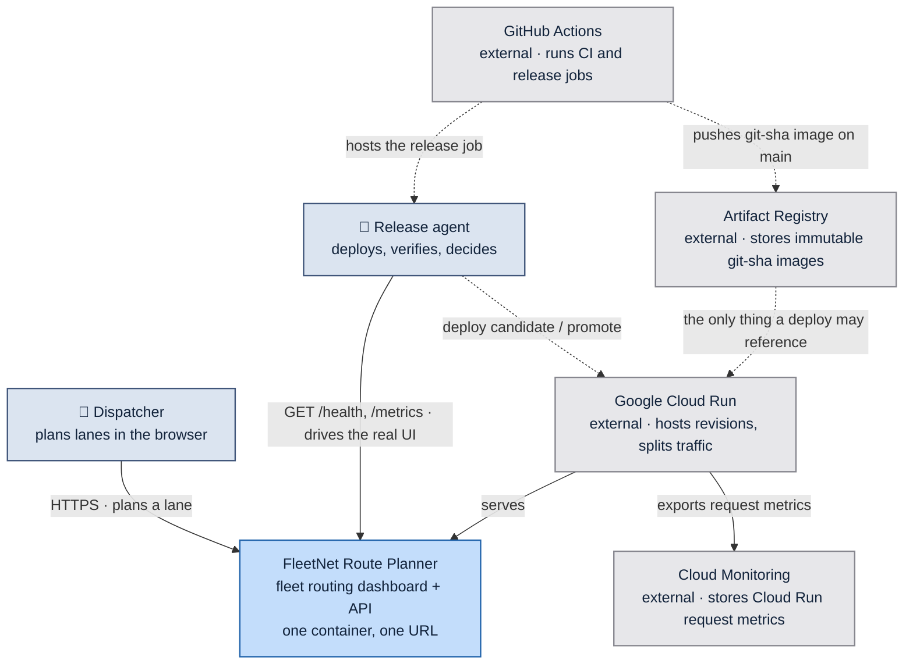
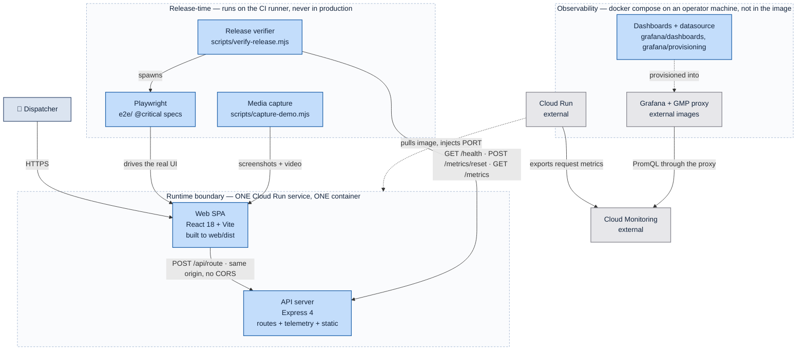
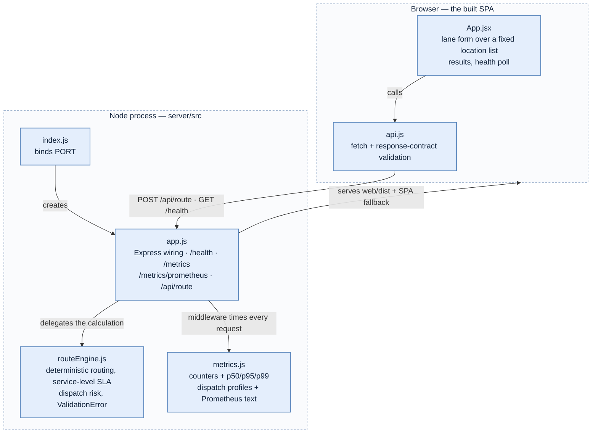
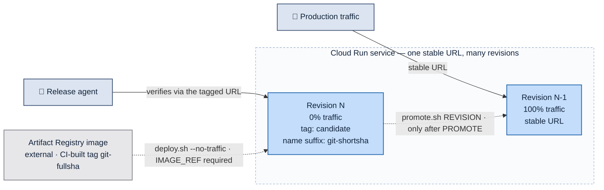
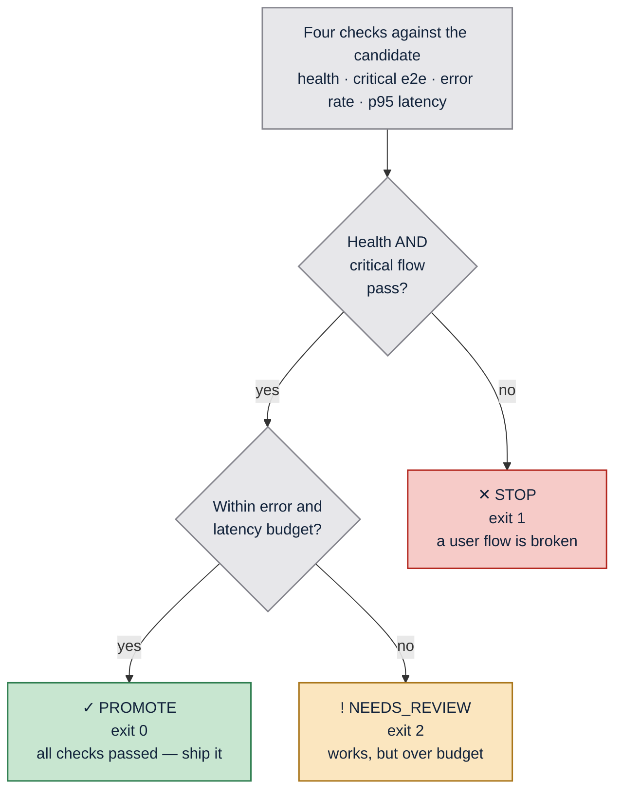
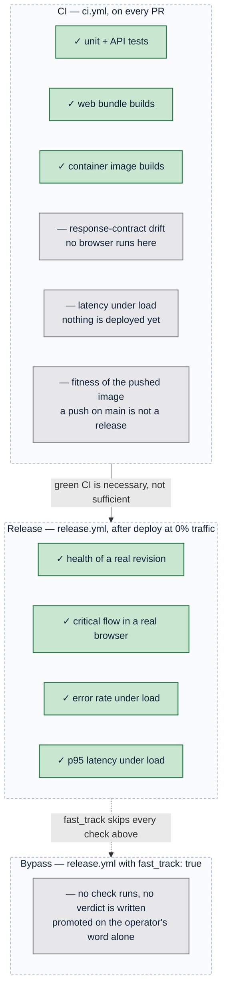

# Architecture

_Generated by the `architecture-doc` skill from `595e651` on 2026-08-18._

FleetNet Route Planner is a single-container fleet-routing dashboard: an Express
process that serves both a JSON routing API and the built React bundle, deployed
as one Cloud Run service. The routing itself is deterministic and fake, which
makes every end-to-end assertion exact rather than approximate.

The application is scenery. The architecture that matters is the **release
gate**: a candidate revision deploys at 0% traffic, gets verified against four
policy checks while real users are still served by the previous revision, and
only then receives traffic. The system is built to make the difference between
"the code compiles" and "the release is fit to ship" structurally visible.

---

## Reading the diagrams

Color here is an encoding, not decoration. Two legends are in use, and every
diagram states which one applies. No diagram mixes them.

**What each channel carries:**

| Channel | Meaning |
| --- | --- |
| Blue family | We build and ship it — a PR can change it |
| Grey | Someone else's contract, or outside what the diagram asserts |
| Saturation within blue | Altitude: saturated = a deployable, pale = a module inside one |
| Green / amber / red | Release outcome only — `PROMOTE` / `NEEDS_REVIEW` / `STOP` |
| Solid edge | Runtime request path |
| Dashed edge | Build- or deploy-time action |

Color is always redundant: every colored node also carries a glyph or word, so
the diagrams survive grayscale printing and color-vision deficiency. Labels are
plain text with `\n` breaks and no HTML, so they render identically wherever
Mermaid runs. The full rules live in
`.claude/skills/architecture-doc/references/color-contract.md`.

---

## C1 — System context

_Legend S — hue = ownership. Solid = runtime request path; dashed = deploy-time action._

The release agent is drawn as an **actor**, not as infrastructure, because it
makes a decision: it reads the verdict and chooses whether traffic moves. That
role is filled either by a human running the scripts or by the `release.yml`
workflow with `auto_promote` enabled — the architecture does not care which.

| Element | Reality |
| --- | --- |
| Dispatcher | Browser user of the SPA |
| Release agent | `scripts/verify-release.mjs` + `promote.sh`, driven by a human or `release.yml` |
| FleetNet Route Planner | This repo — `server/` + `web/`, one image |
| GitHub Actions | `.github/workflows/ci.yml`, `.github/workflows/release.yml` |
| Artifact Registry | `…/warpdemo/fleetnet-route-planner:git-<full-sha>`, pushed by `ci.yml` on `main` |
| Google Cloud Run | Service `fleetnet-route-planner`, region default `northamerica-northeast1` |
| Cloud Monitoring | Cloud Run's own `request_count` / `request_latencies`, read by `grafana/` over PromQL |

---

## C2 — Containers

_Legend S — hue = ownership. All three boundaries are ours; the dashed outline marks containment, not a category._

The boundaries are the load-bearing distinction. Everything in **Runtime** ships
inside the image and serves users. Everything in **Release-time** exists only to
interrogate a candidate and is never deployed — which is why the verifier can
afford to generate load and reset counters without a production blast radius.
**Observability** is a third category again: it reads history after the fact and
no release decision depends on it, so a broken dashboard cannot block a release.

Note what the observability stack does *not* read: the gate's numbers come from
the candidate's own `/metrics`, not from Cloud Monitoring. Monitoring ingestion
lags by up to a minute, and a gate that waits on someone else's pipeline is a
gate that flakes.

| Container | Path | Notes |
| --- | --- | --- |
| Web SPA | `web/src/` → `web/dist/` | Built in Dockerfile stage 1, copied into the runtime stage |
| API server | `server/src/` | Serves `/api/*`, `/health`, `/metrics`, `/metrics/prometheus`, and the SPA fallback |
| Release verifier | `scripts/verify-release.mjs` | Exits 0 / 1 / 2; writes `release-report.json` |
| Playwright | `e2e/route.spec.js` | `@critical` subset gates the release |
| Media capture | `scripts/capture-demo.mjs` | Visual evidence for PRs and release artifacts |
| Dashboards + datasource | `grafana/` | `docker compose up`; a stock Prometheus datasource aimed at the GMP proxy, so the PromQL is portable |

---

## C3 — Components inside the container

_Legend S — every module is pale blue because all of them live inside one already-owned container. Nothing here is independently deployable._

Note what is **not** colored: `api.js` is where the response-contract regression
surfaces, and it would be tempting to paint it red. That would be a legend
violation — red means `STOP` in this document, and this is a structural diagram.
The significance goes in the table instead.

| Component | Responsibility | Why it matters to the release gate |
| --- | --- | --- |
| `web/src/api.js` | Validates that `distance_miles`, `duration_minutes`, `status` are present | Turns a silent schema drift into a thrown error the browser test can see — this is where regression A becomes visible |
| `web/src/App.jsx` | Origin/destination selects over a fixed location list, vehicle + service level, results, 15s health poll | The `data-testid` hooks Playwright asserts against; the poll surfaces the deployed commit as `release-version` |
| `server/src/app.js` | Express wiring; `ROUTE_DELAY_MS` injects upstream latency; stamps `version` / `image_tag` from env | The knob that reproduces regression B without a code change; the stamp is how a revision is tied back to its image |
| `server/src/routeEngine.js` | Deterministic routing; seeded lanes + FNV-1a fallback; service-level buffer → `delivery_sla_minutes`; `dispatch_risk` | Determinism is what lets e2e assert `312 mi / 338 min` exactly — service level changes the commitment, never the road time |
| `server/src/metrics.js` | In-process counters, percentiles over a 500-sample window, bounded dispatch profiles, Prometheus exposition | Supplies every number the policy reads, with no external APM in the decision path |
| `server/src/index.js` | Binds `PORT` | Cloud Run injects it |

Only 5xx responses count as errors. A `400` from a rejected bad request is the
API working correctly, and counting it would make validation coverage look like
an outage.

The two telemetry endpoints are deliberately separate. `/metrics` is the compact
JSON contract the verifier reads and must stay stable; `/metrics/prometheus`
carries richer app dimensions for a scraper. Dispatch-profile labels are
deliberately low-cardinality — vehicle type, service level, distance band,
traffic band, status, risk — and never a lane or a customer, so the series count
stays bounded no matter how many lanes are planned.

---

## Deployment and traffic topology

_Legend S — hue = ownership. Solid = live traffic; dashed = a deliberate operator action._

A candidate is reachable and fully real, but receives **zero** user traffic. It
has its own tagged URL, which is the `BASE_URL` the verifier and Playwright run
against. A failing candidate costs nothing to abandon — it is left at 0% and
production never noticed.

**A deploy never builds.** `deploy.sh` requires `IMAGE_REF` and refuses anything
that is not the immutable `git-<full-sha>` tag `ci.yml` pushed, so the artifact
that was tested is byte-for-byte the artifact that deploys. The short SHA is then
carried through three places — the revision-name suffix, `/health`'s `version`
and `image_tag`, and the commit badge in the UI header — which is what lets a
dashboard row or a screenshot be traced back to an image with no external lookup.

`promote.sh` takes the target revision as an argument and **refuses to run
without one**; there is no "promote whatever is latest". Promotion and rollback
are therefore the same operation pointed at a different revision, which is why
rollback needs no separate rehearsal — and why `release.yml` passes the exact
`candidate_revision` that `deploy.sh` reported rather than trusting ordering.

---

## The release gate

Four checks run against the deployed candidate. The verdict is a function of
**which** checks failed, not how many.

_Legend R — hue = verdict. Each node carries its glyph and exit code, so the diagram and the shell agree._

The amber branch is the design point. A slow-but-working candidate is a judgment
call a human might reasonably override; a broken user flow is not. Collapsing
both into a single "failed" would delete that distinction and force every
release into a binary an agent cannot reason about.

| Check | Threshold | Source |
| --- | --- | --- |
| Playwright critical flow | all `@critical` specs pass | Real browser against the candidate URL |
| Error rate | < 1% | `GET /metrics` → `error_rate` |
| p95 route latency | < 750 ms | `GET /metrics` → `route_latency_ms.p95` |
| Health | `status: "ok"` | `GET /health` |

`release-report.json` writes a `checks` object whose keys map one-to-one onto
these rows, so a downstream agent branches on data rather than parsing output.

One input bypasses all of it. `release.yml` accepts `fast_track`, which skips
install, Playwright, verification, and media capture, then promotes the candidate
revision outright. It produces no verdict and no `release-report.json`, so a
fast-tracked revision is the one case where production is serving something no
gate has looked at. It is labelled development-only in the workflow input, and
that label is the whole control.

---

## What each stage can and cannot see

This is the argument the whole repository exists to make.

_Legend R — green = caught at this stage; grey = structurally invisible to it. The grey rows are the payload._

Playwright is **deliberately absent from CI**. It is not an oversight to fix —
running it pre-merge against a dev server would prove something about a
localhost process, not about the artifact that will serve users. The two
specified regressions both exploit exactly this gap:

| | Regression | CI | Deploy | Verdict |
| --- | --- | --- | --- | --- |
| **A** | `duration_minutes` renamed to `duration` | green | green | `STOP` — `api.js` throws, the browser test sees it |
| **B** | ~2.5 s upstream latency (`ROUTE_DELAY_MS=2500`) | green | green | `NEEDS_REVIEW` — p95 blows the budget |

Both are green through every pre-merge check and deploy successfully. Only a
post-deployment gate catches them.

The `push` job in `ci.yml` sits in the same trap by design. It publishes
`git-<sha>` to Artifact Registry on every merge to `main`, and its own step
summary says so in as many words: the image has passed unit tests and nothing
else. An image existing in the registry is evidence a build succeeded, never
evidence a release is promotable.

---

## Where things live

| Path | Responsibility |
| --- | --- |
| `server/src/routeEngine.js` | Deterministic fake routing, service-level SLA, dispatch risk |
| `server/src/metrics.js` | In-process counters, latency percentiles, dispatch profiles, Prometheus text |
| `server/src/app.js` | Express app — API + telemetry endpoints + static SPA |
| `server/src/index.js` | Process bootstrap, binds `PORT` |
| `web/src/App.jsx` | The dashboard |
| `web/src/api.js` | Response-contract validation |
| `e2e/route.spec.js` | `@critical` release-gating specs |
| `e2e/demo.spec.js` | Recorded walkthrough |
| `e2e/screenshots.spec.js` | Screenshots for PR previews and release artifacts |
| `scripts/verify-release.mjs` | The release gate |
| `scripts/verify-local.sh` | Full rehearsal against a local container |
| `scripts/deploy.sh` | Candidate deploy at 0% traffic from a CI-built image |
| `scripts/promote.sh` | Shift traffic to a named revision — promote or roll back |
| `grafana/` | Local Grafana + GMP proxy over Cloud Run metrics; two provisioned dashboards |
| `.github/workflows/ci.yml` | Pre-merge checks, visual preview comment, image push on `main` |
| `.github/workflows/release.yml` | Deploy → verify → optionally promote |
| `docs/` | Policy, deployment, GCP setup, regression playbook |

---

## Key decisions

_Hand-authored. The `architecture-doc` skill never rewrites this section._

**Routing is fake and deterministic.** The same inputs always produce the same
numbers, which lets end-to-end tests assert exact values (`312 mi / 338 min`)
instead of ranges. A flaky assertion in a release gate is worse than no gate —
it trains people to re-run until green.

**One container, not two.** Express serves both the API and the built SPA, so
there is one Cloud Run service, one URL, and no CORS. The cost is that the web
and API cannot scale independently; at this size that trade is obviously right,
and splitting later is a Dockerfile change plus a traffic rule.

**Telemetry is in-process, not an APM.** `metrics.js` is ~90 lines and exposes
exactly what the policy needs over HTTP. A release agent can `curl /metrics` and
decide, with no vendor, no credentials, and no ingestion delay between the load
being generated and the number being readable.

**`/metrics/reset` exists so p95 means something.** Without it, percentiles from
a long-lived revision would be dominated by warm-up noise, and the gate would
measure history rather than this candidate.

**Verdicts are three-valued, and the exit codes carry them.** 0 / 2 / 1 map to
`PROMOTE` / `NEEDS_REVIEW` / `STOP` so a shell, a CI step, and an agent can all
branch on the same signal without parsing text.

**Candidates deploy at 0% traffic.** Verification runs against a real revision on
real infrastructure while users are still served by the previous one. This is
what makes a failed verification cheap: the fix is to do nothing.

_Appended on the refresh from `595e651`; nothing above was edited._ Two of the
decisions above have picked up context since they were written. **Telemetry is
in-process** still holds for the gate — the verifier reads only the candidate's
own `/metrics`, and `grafana/` plus `/metrics/prometheus` sit outside the decision
path, for humans reading history. **Candidates deploy at 0% traffic** is now
enforced harder: `deploy.sh` refuses anything but a CI-built `git-<full-sha>`
image and `promote.sh` refuses to run without an explicit target revision. The
one pull in the other direction is `release.yml`'s `fast_track`, which promotes
with no verdict at all.
