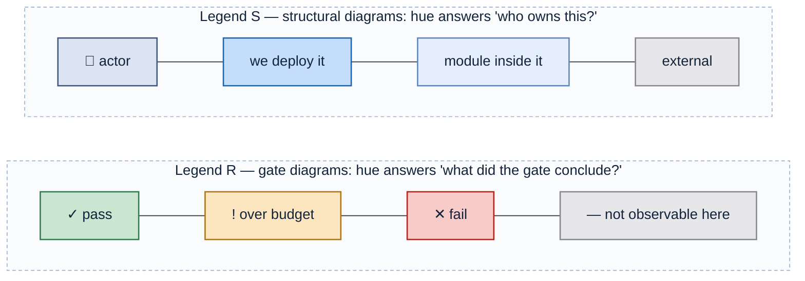
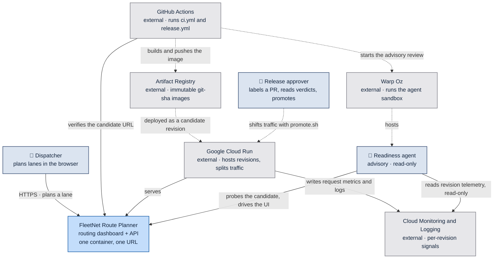
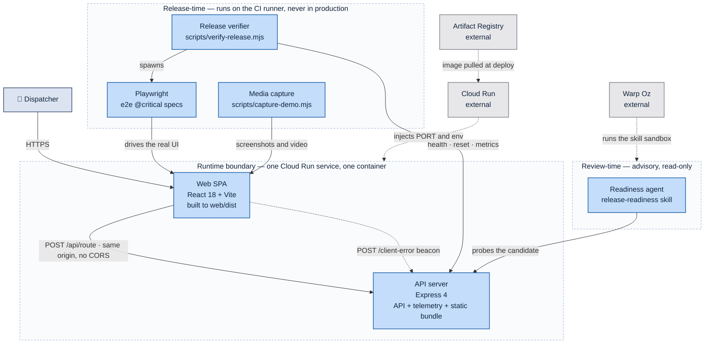
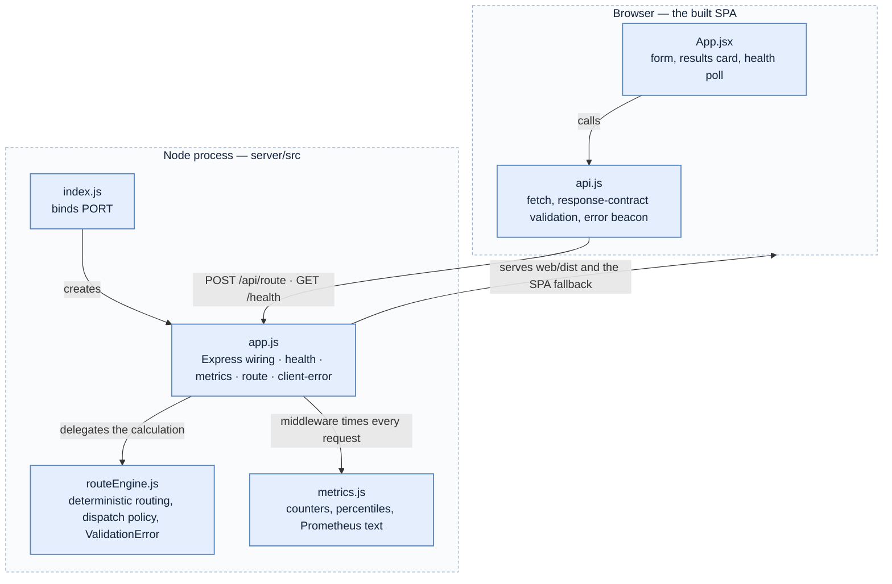
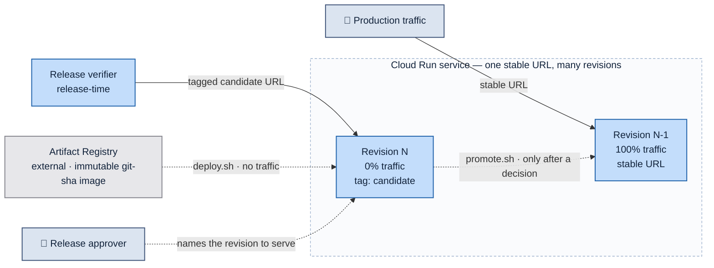
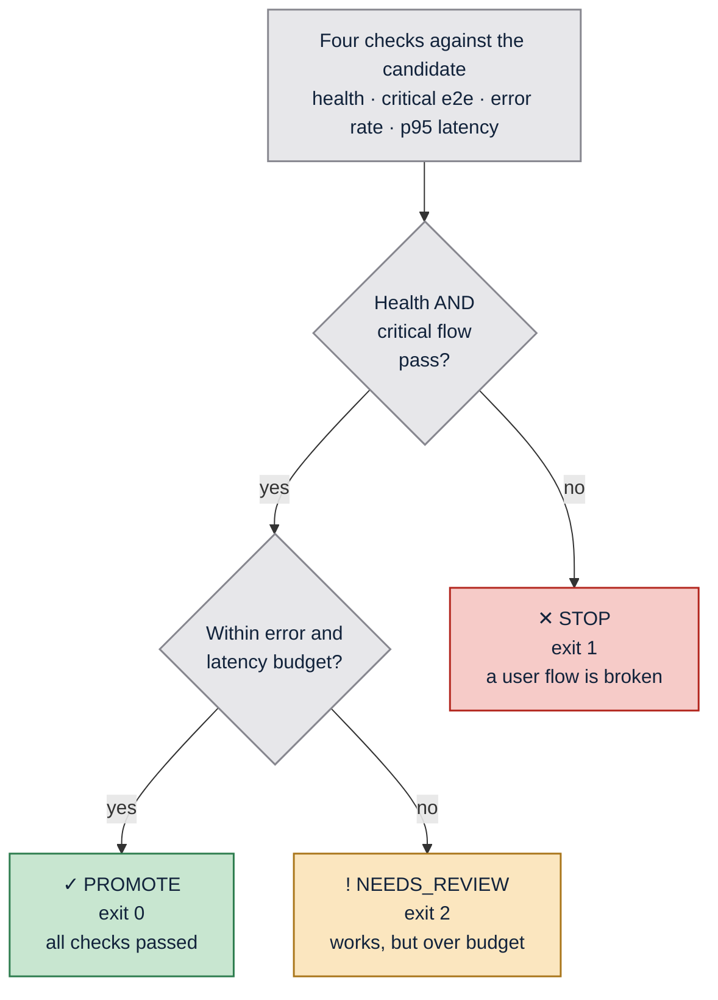
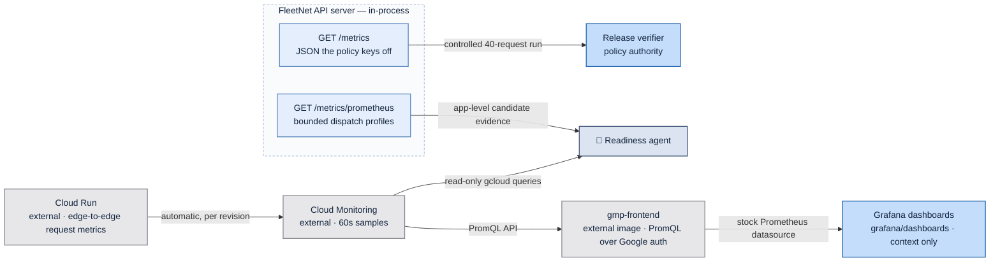

# Architecture

_Generated by the `architecture-doc` skill from `7e0de85` on 2026-08-18._

FleetNet Route Planner is a single-container fleet-routing dashboard: an Express
process that serves both a JSON routing API and the built React bundle, deployed
as one Cloud Run service. The routing itself is deterministic and fake, which
makes every end-to-end assertion exact rather than approximate.

The application is scenery. The architecture that matters is the **release
gate**: a candidate revision deploys at 0% traffic, gets verified against four
policy checks while real users are still served by the previous revision, and
only then receives traffic. An advisory readiness review runs beside the gate and
asks the question no threshold expresses — whether those checks reached what the
change touched.

---

## Reading the diagrams

Color here is an encoding, not decoration. Two legends are in use, and every
diagram states which one applies. No diagram mixes them.

**What each channel carries:**

| Channel | Meaning |
| --- | --- |
| Blue family | We build and ship it — a PR can change it |
| Grey | Someone else's contract, or outside what the diagram asserts |
| Saturation within blue | Altitude: saturated = a deployable, pale = a module inside one |
| Green / amber / red | Release outcome only — `PROMOTE` / `NEEDS_REVIEW` / `STOP` |
| Solid edge | Runtime request path |
| Dashed edge | Build- or deploy-time action |

Color is always redundant: every colored node also carries a glyph or word, so
the diagrams survive grayscale printing and color-vision deficiency. Labels are
plain text with `\n` breaks and no HTML, so they render identically wherever
Mermaid runs. The full rules live in
`.claude/skills/architecture-doc/references/color-contract.md`.

---

## C1 — System context

_Legend S — hue = ownership. Solid = runtime request path; dashed = deploy-time action._

Both the approver and the readiness agent are drawn as **actors**, not as
infrastructure, because each produces a judgement. Only the approver can move
traffic: the agent's identity holds `roles/monitoring.viewer` and
`roles/logging.viewer` and nothing else, so its verdict is advice by
construction.

| Element | Reality |
| --- | --- |
| Dispatcher | Browser user of the SPA |
| Release approver | Runs `scripts/promote.sh`, or dispatches `release.yml` with `auto_promote` |
| Readiness agent | `.claude/skills/release-readiness/SKILL.md` on the `oz/Dockerfile` image |
| FleetNet Route Planner | This repo — `server/` + `web/`, one image |
| GitHub Actions | `.github/workflows/ci.yml`, `.github/workflows/release.yml` |
| Artifact Registry | `northamerica-northeast1-docker.pkg.dev/warpdemo-505821/warpdemo/fleetnet-route-planner` |
| Google Cloud Run | Service `fleetnet-route-planner`, region `northamerica-northeast1` |
| Cloud Monitoring and Logging | Built-in Cloud Run request metrics plus the app's structured JSON logs |
| Warp Oz | Environment `6E6yxZoQ6uUZCFDrQDiZ7Z`, launched by `oz agent run-cloud` |

---

## C2 — Containers

_Legend S — hue = ownership. The three boundaries are ours; the dashed outline marks containment, not a category._

The boundaries are the load-bearing distinction. Everything in **Runtime** ships
inside the image and serves users. Everything in **Release-time** and
**Review-time** exists only to interrogate a candidate and is never deployed,
which is why the verifier can generate load and reset counters with no
production blast radius.

| Container | Path | Notes |
| --- | --- | --- |
| Web SPA | `web/src/` → `web/dist/` | Built in Dockerfile stage 1, copied into the runtime stage |
| API server | `server/src/` | Serves `/api/route`, `/health`, `/metrics`, `/metrics/prometheus`, `/client-error`, and the SPA fallback |
| Release verifier | `scripts/verify-release.mjs` | Exits 0 / 1 / 2; writes `release-report.json` |
| Playwright | `e2e/route.spec.js` | `@critical` subset gates the release; `retries: 0` |
| Media capture | `scripts/capture-demo.mjs`, `e2e/screenshots.spec.js`, `e2e/demo.spec.js` | Visual evidence for PR comments and release artifacts |
| Readiness agent | `.claude/skills/release-readiness/SKILL.md`, `oz/Dockerfile` | Repo-owned skill and image; Warp Oz supplies the sandbox |

---

## C3 — Components inside the container

_Legend S — every module is pale blue because all of them live inside one already-owned container. Nothing here is independently deployable._

Note what is **not** colored: `api.js` is where the response-contract regression
surfaces, and it would be tempting to paint it red. That would be a legend
violation — red means `STOP` in this document, and this is a structural diagram.
The significance goes in the table instead.

| Component | Responsibility | Why it matters to the release gate |
| --- | --- | --- |
| `web/src/api.js` | Requires `distance_miles`, `duration_minutes`, `status`, `estimated_cost_usd`; beacons failures to `/client-error` | Turns silent schema drift into a thrown error the browser test sees — where regression A becomes visible |
| `web/src/App.jsx` | Form, results card, 15s health poll, deployed-commit badge | The `data-testid` hooks Playwright asserts against |
| `server/src/app.js` | Express wiring; `ROUTE_DELAY_MS` injects upstream latency; structured JSON logs | The knob that reproduces regression B without a code change |
| `server/src/routeEngine.js` | Deterministic lanes, vehicle multipliers, service-level policy, cost, SLA state, dispatch risk | Determinism is what lets e2e assert `312 mi / 5h 38m / $655.20` exactly |
| `server/src/metrics.js` | In-process counters, percentiles over a 500-sample window, bounded Prometheus profiles | The whole observability stack the policy needs — no external APM |
| `server/src/index.js` | Binds `PORT` | Cloud Run injects it |

Only 5xx responses count as errors. A `400` from a rejected bad request — an
unknown vehicle, or refrigerated freight on a cargo van — is the API working
correctly, and counting it would make validation coverage look like an outage.

---

## Deployment and traffic topology

_Legend S — hue = ownership. Solid = live traffic; dashed = a deliberate operator action._

A candidate is reachable and fully real, but receives **zero** user traffic. It
has its own tagged URL, which is the `BASE_URL` the verifier and Playwright run
against. A failing candidate costs nothing to abandon: it stays at 0% and
production never noticed.

`deploy.sh` refuses any image reference that is not an immutable `git-` commit
tag, and carries that short SHA into the revision name, the `/health` response,
and the UI header. A revision on a dashboard is therefore traceable to its commit
without an external lookup.

`promote.sh` requires an explicit revision and refuses to promote an unspecified
latest. Promotion and rollback are the same command pointed at a different
revision, which is why rollback needs no separate rehearsal.

---

## The release gate

Four checks run against the deployed candidate. The verdict is a function of
**which** checks failed, not how many.

_Legend R — hue = verdict. Each node carries its glyph and exit code, so the diagram and the shell agree._

The amber branch is the design point. A slow-but-working candidate is a judgment
call a human might reasonably override; a broken user flow is not. Collapsing
both into a single "failed" would delete that distinction and force every release
into a binary an agent cannot reason about.

| Check | Threshold | Source |
| --- | --- | --- |
| Playwright critical flow | all `@critical` specs pass | Real browser against the candidate URL |
| Error rate | < 1%, override `POLICY_MAX_ERROR_RATE` | `GET /metrics` → `error_rate` |
| p95 route latency | < 750 ms, override `POLICY_MAX_P95_MS` | `GET /metrics` → `route_latency_ms.p95` |
| Health | `status: "ok"` | `GET /health` |

`release-report.json` writes a `checks` object whose keys map one-to-one onto
these rows, so a downstream agent branches on data rather than parsing output.
The report also records the candidate revision alongside the baseline revision
serving production at deploy time — a verdict is only interpretable against the
thing it was compared to.

---

## The advisory review beside the gate

Labelling a pull request `deploy-candidate` deploys its head commit at 0% traffic
and runs the whole release path against it. Nothing merges and no traffic moves,
so the label is a request for evidence. `release.yml` then stamps both verdicts
onto the pull request, because a verdict nobody can see from the list is a
verdict nobody acts on.

| Surface | Values | Written by |
| --- | --- | --- |
| Gate label | `gate:promote`, `gate:needs-review`, `gate:stop` | The gate-verdict step, from `release-report.json` |
| Agent label | `agent:reviewing`, `agent:ready`, `agent:human-review`, `agent:not-ready` | The agent itself, at the end of its brief |
| Candidate comment | Gate verdict, candidate and baseline revisions, candidate URL, brief link | The release-result step, updated in place |

The two answers are not interchangeable. The gate says whether the checks passed.
The brief says whether those checks reached what the pull request changed, which
is why `HUMAN REVIEW` is a real outcome even when every check is green. The
review is advisory: it never gates the job, and its credentials cannot deploy or
shift traffic. It is skipped rather than failed when `WARP_API_KEY` is absent, so
the release path never depends on the agent being configured.

---

## What each stage can and cannot see

This is the argument the whole repository exists to make.

```mermaid
flowchart LR
    subgraph ci["CI — ci.yml, on every pull request"]
        ci1["✓ unit + API tests"]
        ci2["✓ web bundle builds"]
        ci3["✓ image builds and pushes"]
        ci4["— response-contract drift\nno browser runs here"]
        ci5["— latency under load\nnothing is deployed yet"]
    end

    subgraph rel["Release gate — release.yml, candidate at 0% traffic"]
        r1["✓ health of a real revision"]
        r2["✓ critical flow in a real browser"]
        r3["✓ error rate under load"]
        r4["✓ p95 latency under load"]
        r5["— whether those checks reached\nwhat the change touched"]
    end

    subgraph rev["Readiness review — advisory, no gate power"]
        v1["✓ coverage of the changed paths"]
        v2["✓ candidate against baseline telemetry"]
        v3["— cannot block, promote, or roll back"]
    end

    ci -->|"green CI is necessary, not sufficient"| rel
    rel -->|"passing checks are evidence, not coverage"| rev

    classDef pass  fill:#c8e6d0,stroke:#2e7d4f,stroke-width:1.5px,color:#12233b
    classDef blind fill:#e7e7ea,stroke:#87878f,stroke-width:1.5px,color:#12233b
    classDef boundary fill:#fafbfd,stroke:#9db2cd,stroke-width:1px,stroke-dasharray:4 3,color:#12233b
    class ci1,ci2,ci3,r1,r2,r3,r4,v1,v2 pass
    class ci4,ci5,r5,v3 blind
    class ci,rel,rev boundary
```

_Legend R — green = caught at this stage; grey = structurally invisible to it. The grey rows are the payload._

Playwright is **deliberately absent from CI**. It is not an oversight to fix:
running it pre-merge against a dev server would prove something about a localhost
process, not about the artifact that will serve users. CI does push a
commit-addressed image for same-repo pull requests, so a change can be deployed
before it merges — but a pushed image has passed unit tests and nothing else.

The two specified regressions both exploit exactly this gap:

| | Regression | CI | Deploy | Verdict |
| --- | --- | --- | --- | --- |
| **A** | `duration_minutes` renamed to `duration` | green | green | `STOP` — `api.js` throws, the browser test sees it |
| **B** | ~2.5 s upstream latency (`ROUTE_DELAY_MS=2500`) | green | green | `NEEDS_REVIEW` — p95 blows the budget |

Both are green through every pre-merge check and deploy successfully. Only a
post-deployment gate catches them. Neither is implemented on `main`;
`docs/regressions.md` specifies them.

---

## Where the numbers come from

Three telemetry surfaces exist, they measure different things, and a brief that
compares them as one metric is wrong.

_Legend S — hue = ownership; saturation = altitude. Solid = a query path a reader can run today._

| Surface | Measures | Consumer |
| --- | --- | --- |
| `GET /metrics` | Per-route in-process latency and 5xx rate since the last reset | `scripts/verify-release.mjs`, the only policy authority |
| `GET /metrics/prometheus` | Route calculations, planned miles and minutes, rolling percentiles, configured delay, per dispatch profile | Agent evidence; no scraper is wired to it |
| Cloud Run built-in metrics | Edge-to-edge request latency and count per revision, static assets included | `grafana/` dashboards and read-only agent queries |

Lane and customer identifiers are never Prometheus labels. Dispatch profiles use
`vehicle_type`, `service_level`, `distance_band`, `traffic_band`, `status`, and
`dispatch_risk`, all bounded, so cardinality cannot grow with traffic.

Cloud Run's numbers are not the gate's numbers, and the dashboards are not a
second gate. Under a schema regression the service dashboard stays entirely
green while the product is broken; that contrast is why
`grafana/dashboards/fleetnet-observability-firehose.json` exists.

---

## Assets that ship outside FleetNet's release path

These live in the repo, support the demo, and are part of neither the FleetNet
image nor its release gate. Treating them as part of the gate is the mistake this
section exists to prevent.

| Asset | What it is | How it ships |
| --- | --- | --- |
| `grafana/` | Local Grafana plus a `gmp-frontend` proxy over Cloud Monitoring, read-only | `docker compose up` on a workstation; the key and its path are gitignored |
| `oz/` | The agent's base image — `dev-web` plus the gcloud CLI — and the Oz environment recipe | Built and pushed by hand; `GCP_SA_KEY` is a read-only Oz secret |
| `llmProxy/` | A separate Cloud Run service proxying OpenAI-shaped requests to Gemini on Vertex AI, for Warp's BYO-LLM setting | `gcloud run deploy --source .`; no CI workflow and no Artifact Registry image |
| `docs/investigations/` | Evidence-led records of bugs found while building the demo | Markdown only |
| `docs/concepts/`, `docs/ideas/` | Oz platform notes and the release-agent framing | Markdown only |

---

## Where things live

| Path | Responsibility |
| --- | --- |
| `server/src/routeEngine.js` | Deterministic routing, dispatch and pricing policy |
| `server/src/metrics.js` | In-process counters, percentiles, Prometheus exposition |
| `server/src/app.js` | Express app — API, telemetry, client-error log, static SPA |
| `server/src/index.js` | Process bootstrap, binds `PORT` |
| `web/src/App.jsx` | The dashboard |
| `web/src/api.js` | Response-contract validation and the error beacon |
| `e2e/route.spec.js` | `@critical` release-gating specs |
| `e2e/screenshots.spec.js` | `@screenshot` captures for PR evidence |
| `e2e/demo.spec.js` | Recorded walkthrough |
| `scripts/verify-release.mjs` | The release gate |
| `scripts/verify-local.sh` | Full rehearsal against a local container |
| `scripts/deploy.sh` | Candidate deploy at 0% traffic |
| `scripts/promote.sh` | Promote or roll back a named revision |
| `scripts/capture-demo.mjs` | Screenshots and walkthrough video |
| `.github/workflows/ci.yml` | Pre-merge checks, image push, visual preview comment |
| `.github/workflows/release.yml` | Deploy, verify, review, label, optionally promote |
| `.claude/skills/` | Repo skills, including `release-readiness` and this document's generator |
| `grafana/`, `oz/`, `llmProxy/` | Support assets outside the release path |
| `docs/` | Policy, deployment, GCP setup, regression playbook, investigations |

---

## Key decisions

_Hand-authored. The `architecture-doc` skill never rewrites this section._

**Routing is fake and deterministic.** The same inputs always produce the same
numbers, which lets end-to-end tests assert exact values (`312 mi / 338 min`)
instead of ranges. A flaky assertion in a release gate is worse than no gate —
it trains people to re-run until green.

**One container, not two.** Express serves both the API and the built SPA, so
there is one Cloud Run service, one URL, and no CORS. The cost is that the web
and API cannot scale independently; at this size that trade is obviously right,
and splitting later is a Dockerfile change plus a traffic rule.

**Telemetry is in-process, not an APM.** `metrics.js` is ~90 lines and exposes
exactly what the policy needs over HTTP. A release agent can `curl /metrics` and
decide, with no vendor, no credentials, and no ingestion delay between the load
being generated and the number being readable.

**`/metrics/reset` exists so p95 means something.** Without it, percentiles from
a long-lived revision would be dominated by warm-up noise, and the gate would
measure history rather than this candidate.

**Verdicts are three-valued, and the exit codes carry them.** 0 / 2 / 1 map to
`PROMOTE` / `NEEDS_REVIEW` / `STOP` so a shell, a CI step, and an agent can all
branch on the same signal without parsing text.

**Candidates deploy at 0% traffic.** Verification runs against a real revision on
real infrastructure while users are still served by the previous one. This is
what makes a failed verification cheap: the fix is to do nothing.
