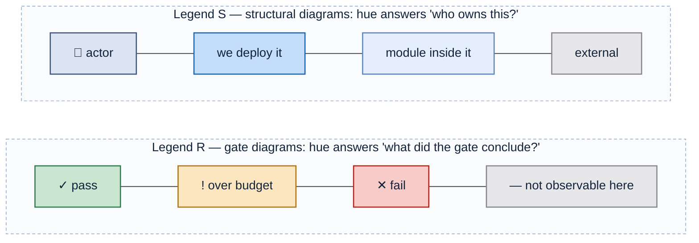
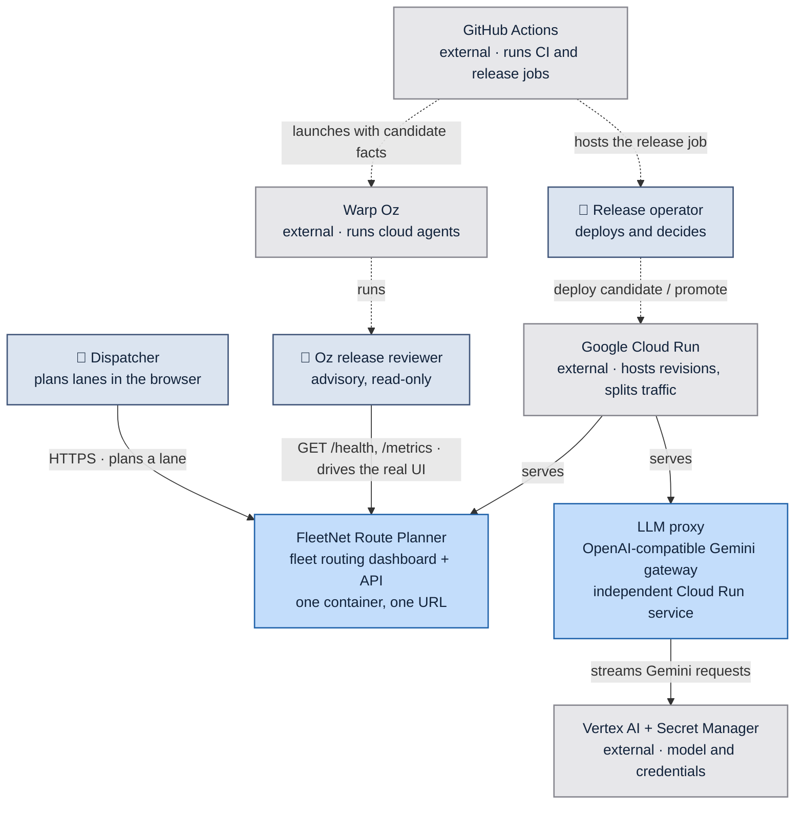
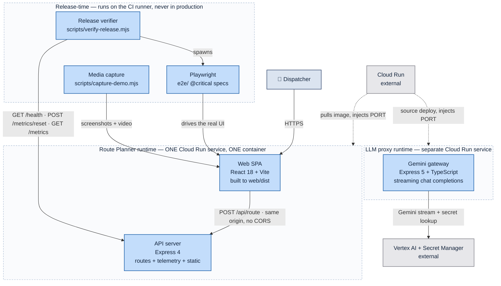
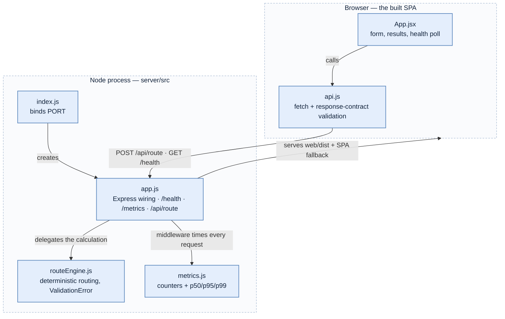
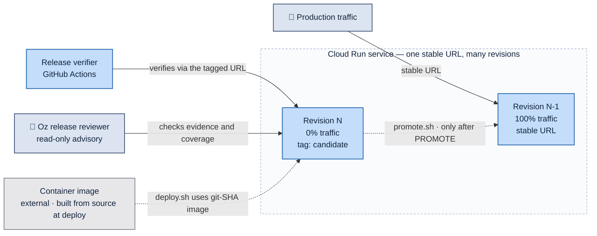
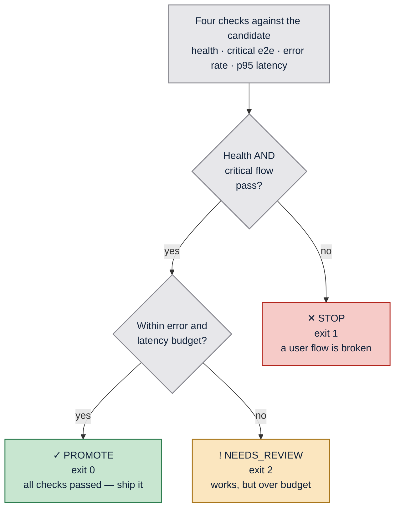

# Architecture

_Generated by the `architecture-doc` skill from `7e0de85` on 2026-08-20._

FleetNet Route Planner is a single-container fleet-routing dashboard: an Express
process serves both a JSON routing API and the built React bundle as one Cloud
Run service. The repository also contains an independently deployed LLM proxy
that adapts Warp requests to Gemini on Vertex AI.

The application is scenery. The architecture that matters is the **release
gate and advisory review**: a candidate revision deploys at 0% traffic, gets
verified against four policy checks while users stay on the previous revision,
then receives a read-only Oz release-readiness review before a human promotion
decision. This makes the difference between "the code compiles" and "the
release is fit to ship" structurally visible.

---

## Reading the diagrams

Color here is an encoding, not decoration. Two legends are in use, and every
diagram states which one applies. No diagram mixes them.

**What each channel carries:**

| Channel | Meaning |
| --- | --- |
| Blue family | We build and ship it — a PR can change it |
| Grey | Someone else's contract, or outside what the diagram asserts |
| Saturation within blue | Altitude: saturated = a deployable, pale = a module inside one |
| Green / amber / red | Release outcome only — `PROMOTE` / `NEEDS_REVIEW` / `STOP` |
| Solid edge | Runtime request path |
| Dashed edge | Build- or deploy-time action |

Color is always redundant: every colored node also carries a glyph or word, so
the diagrams survive grayscale printing and color-vision deficiency. Labels are
plain text with `\n` breaks and no HTML, so they render identically wherever
Mermaid runs. The full rules live in
`.claude/skills/architecture-doc/references/color-contract.md`.

---

## C1 — System context

_Legend S — hue = ownership. Solid = runtime request path; dashed = deploy-time action._

The operator owns the promotion decision. The Oz agent is a separate advisory
actor: `release.yml` gives it candidate facts, it reviews whether the gate
covered the change, and it cannot deploy or shift traffic.

| Element | Reality |
| --- | --- |
| Dispatcher | Browser user of the SPA |
| Release operator | Human or `release.yml`; `scripts/promote.sh` moves traffic |
| Oz release reviewer | `.claude/skills/release-readiness/SKILL.md`, launched read-only by `release.yml` |
| FleetNet Route Planner | This repo — `server/` + `web/`, one image |
| LLM proxy | `llmProxy/`, a separately deployed BYO-LLM demo service |
| GitHub Actions | `.github/workflows/ci.yml`, `.github/workflows/release.yml` |
| Warp Oz | Agent environment and execution platform documented in `oz/README.md` |
| Google Cloud Run | Services `fleetnet-route-planner` and `llm-proxy` |
| Vertex AI + Secret Manager | Gemini inference and proxy API-key storage |

---

## C2 — Containers

_Legend S — hue = ownership. The dashed outlines mark containment, not a category._

The Route Planner and LLM proxy are independently deployed. Release-time tools
interrogate only Route Planner candidates and never ship in either service,
which is why the verifier can generate load and reset counters without a
production blast radius.

| Container | Path | Notes |
| --- | --- | --- |
| Web SPA | `web/src/` → `web/dist/` | Built in Dockerfile stage 1, copied into the runtime stage |
| API server | `server/src/` | Serves `/api/*`, `/health`, `/metrics`, and the SPA fallback |
| LLM proxy | `llmProxy/src/` | Express gateway to Vertex Gemini with secret-backed auth and bounded concurrency |
| Release verifier | `scripts/verify-release.mjs` | Exits 0 / 1 / 2; writes `release-report.json` |
| Playwright | `e2e/route.spec.js` | `@critical` subset gates the release |
| Media capture | `scripts/capture-demo.mjs` | Visual evidence for PRs and release artifacts |

---

## C3 — Components inside the container

_Legend S — every module is pale blue because all of them live inside one already-owned container. Nothing here is independently deployable._

Note what is **not** colored: `api.js` is where the response-contract regression
surfaces, and it would be tempting to paint it red. That would be a legend
violation — red means `STOP` in this document, and this is a structural diagram.
The significance goes in the table instead.

| Component | Responsibility | Why it matters to the release gate |
| --- | --- | --- |
| `web/src/api.js` | Validates that `distance_miles`, `duration_minutes`, `status` are present | Turns a silent schema drift into a thrown error the browser test can see — this is where regression A becomes visible |
| `web/src/App.jsx` | Form, results, 15s health poll | The `data-testid` hooks Playwright asserts against |
| `server/src/app.js` | Express wiring; `ROUTE_DELAY_MS` injects upstream latency | The knob that reproduces regression B without a code change |
| `server/src/routeEngine.js` | Deterministic routing; seeded lanes + FNV-1a fallback | Determinism is what lets e2e assert `312 mi / 338 min` exactly |
| `server/src/metrics.js` | In-process counters, percentiles over a 500-sample window | The entire observability stack the policy needs — no external APM |
| `server/src/index.js` | Binds `PORT` | Cloud Run injects it |

Only 5xx responses count as errors. A `400` from a rejected bad request is the
API working correctly, and counting it would make validation coverage look like
an outage.

---

## Deployment and traffic topology

_Legend S — hue = ownership. Solid = live traffic; dashed = a deliberate operator action._

A candidate is reachable and fully real, but receives **zero** user traffic. It
has its own tagged URL, which is the `BASE_URL` the verifier and Playwright run
against. A failing candidate costs nothing to abandon — it is left at 0% and
production never noticed.
After the gate, `release.yml` launches an Oz agent with the candidate revision,
URL, baseline revision, and gate verdict. The agent uses a read-only GCP service
account, posts an advisory brief, and cannot promote.

`promote.sh` with no argument sends 100% to the latest revision; with a revision
name it rolls back. Promotion and rollback are the same operation pointed at a
different revision, which is why rollback needs no separate rehearsal.

---

## The release gate

Four checks run against the deployed candidate. The verdict is a function of
**which** checks failed, not how many.

_Legend R — hue = verdict. Each node carries its glyph and exit code, so the diagram and the shell agree._

The amber branch is the design point. A slow-but-working candidate is a judgment
call a human might reasonably override; a broken user flow is not. Collapsing
both into a single "failed" would delete that distinction and force every
release into a binary an agent cannot reason about.

| Check | Threshold | Source |
| --- | --- | --- |
| Playwright critical flow | all `@critical` specs pass | Real browser against the candidate URL |
| Error rate | < 1% | `GET /metrics` → `error_rate` |
| p95 route latency | < 750 ms | `GET /metrics` → `route_latency_ms.p95` |
| Health | `status: "ok"` | `GET /health` |

`release-report.json` writes a `checks` object whose keys map one-to-one onto
these rows, so a downstream agent branches on data rather than parsing output.

---

## What each stage can and cannot see

This is the argument the whole repository exists to make.

```mermaid
flowchart LR
    subgraph ci["CI — ci.yml, on every PR"]
        ci1["✓ unit + API tests"]
        ci2["✓ web bundle builds"]
        ci3["✓ container image builds"]
        ci4["— response-contract drift\nno browser runs here"]
        ci5["— latency under load\nnothing is deployed yet"]
    end

    subgraph rel["Release — release.yml, after deploy at 0% traffic"]
        r1["✓ health of a real revision"]
        r2["✓ critical flow in a real browser"]
        r3["✓ error rate under load"]
        r4["✓ p95 latency under load"]
    end

    ci -->|"green CI is necessary, not sufficient"| rel

    classDef pass  fill:#c8e6d0,stroke:#2e7d4f,stroke-width:1.5px,color:#12233b
    classDef blind fill:#e7e7ea,stroke:#87878f,stroke-width:1.5px,color:#12233b
    classDef boundary fill:#fafbfd,stroke:#9db2cd,stroke-width:1px,stroke-dasharray:4 3,color:#12233b
    class ci1,ci2,ci3,r1,r2,r3,r4 pass
    class ci4,ci5 blind
    class ci,rel boundary
```

_Legend R — green = caught at this stage; grey = structurally invisible to it. The grey rows are the payload._

Playwright is **deliberately absent from CI**. It is not an oversight to fix —
running it pre-merge against a dev server would prove something about a
localhost process, not about the artifact that will serve users. The two
specified regressions both exploit exactly this gap:

| | Regression | CI | Deploy | Verdict |
| --- | --- | --- | --- | --- |
| **A** | `duration_minutes` renamed to `duration` | green | green | `STOP` — `api.js` throws, the browser test sees it |
| **B** | ~2.5 s upstream latency (`ROUTE_DELAY_MS=2500`) | green | green | `NEEDS_REVIEW` — p95 blows the budget |

Both are green through every pre-merge check and deploy successfully. Only a
post-deployment gate catches them.

---

## Where things live

| Path | Responsibility |
| --- | --- |
| `server/src/routeEngine.js` | Deterministic fake routing |
| `server/src/metrics.js` | In-process counters and latency percentiles |
| `server/src/app.js` | Express app — API + static SPA |
| `server/src/index.js` | Process bootstrap, binds `PORT` |
| `web/src/App.jsx` | The dashboard |
| `web/src/api.js` | Response-contract validation |
| `e2e/route.spec.js` | `@critical` release-gating specs |
| `e2e/demo.spec.js` | Recorded walkthrough |
| `scripts/verify-release.mjs` | The release gate |
| `scripts/verify-local.sh` | Full rehearsal against a local container |
| `scripts/deploy.sh` | Candidate deploy at 0% traffic |
| `scripts/promote.sh` | Promote or roll back |
| `.github/workflows/ci.yml` | Pre-merge checks + visual preview comment |
| `.github/workflows/release.yml` | Deploy → verify → Oz advisory review → optionally promote |
| `.claude/skills/release-readiness/SKILL.md` | Advisory review of gate coverage and changed behavior |
| `.claude/skills/on-call-service-triage/SKILL.md` | Read-only production health and latency investigation |
| `oz/Dockerfile` | Oz environment image with browsers and gcloud |
| `oz/README.md` | Oz environment, identity, agent, and secret setup |
| `llmProxy/src/` | OpenAI-compatible Vertex Gemini proxy |
| `llmProxy/Dockerfile` | Independently deployable proxy image |
| `docs/` | Policy, deployment, regression playbook |

---

## Key decisions

_Hand-authored. The `architecture-doc` skill never rewrites this section._

**Routing is fake and deterministic.** The same inputs always produce the same
numbers, which lets end-to-end tests assert exact values (`312 mi / 338 min`)
instead of ranges. A flaky assertion in a release gate is worse than no gate —
it trains people to re-run until green.

**One container, not two.** Express serves both the API and the built SPA, so
there is one Cloud Run service, one URL, and no CORS. The cost is that the web
and API cannot scale independently; at this size that trade is obviously right,
and splitting later is a Dockerfile change plus a traffic rule.

**Telemetry is in-process, not an APM.** `metrics.js` is ~90 lines and exposes
exactly what the policy needs over HTTP. A release agent can `curl /metrics` and
decide, with no vendor, no credentials, and no ingestion delay between the load
being generated and the number being readable.

**`/metrics/reset` exists so p95 means something.** Without it, percentiles from
a long-lived revision would be dominated by warm-up noise, and the gate would
measure history rather than this candidate.

**Verdicts are three-valued, and the exit codes carry them.** 0 / 2 / 1 map to
`PROMOTE` / `NEEDS_REVIEW` / `STOP` so a shell, a CI step, and an agent can all
branch on the same signal without parsing text.

**Candidates deploy at 0% traffic.** Verification runs against a real revision on
real infrastructure while users are still served by the previous one. This is
what makes a failed verification cheap: the fix is to do nothing.
