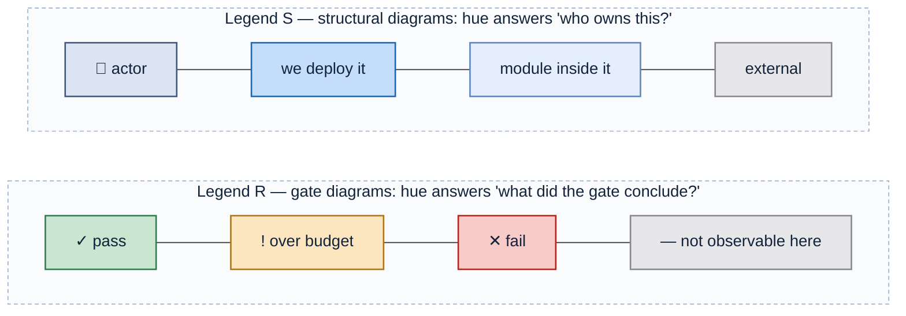
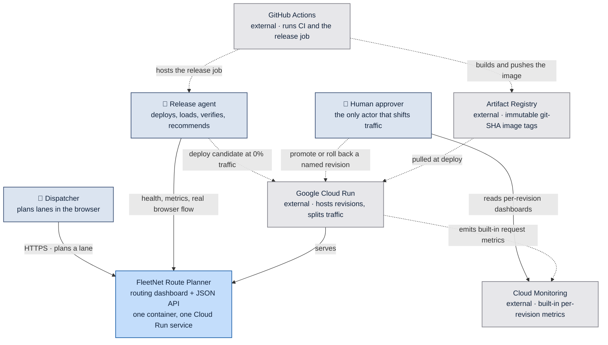
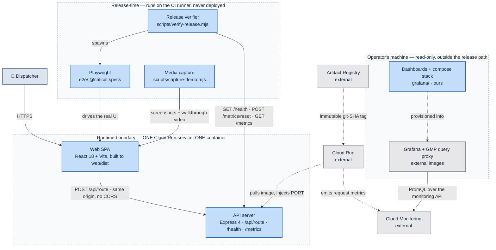
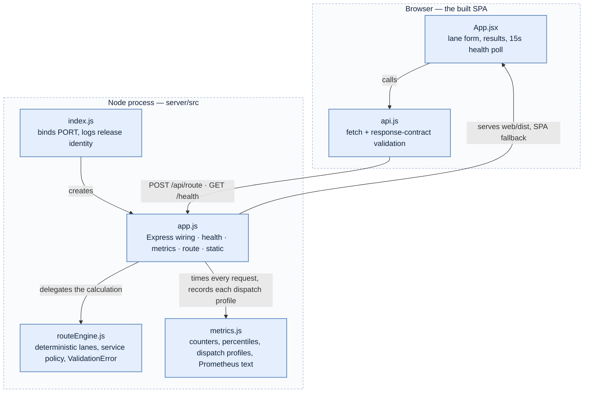
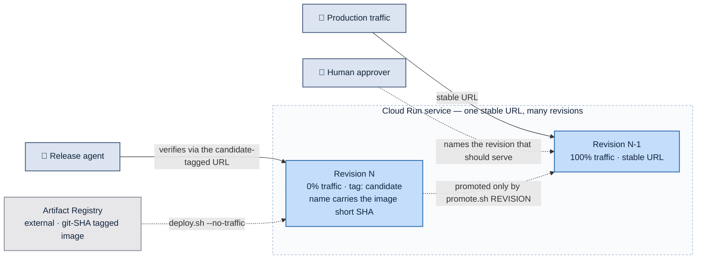
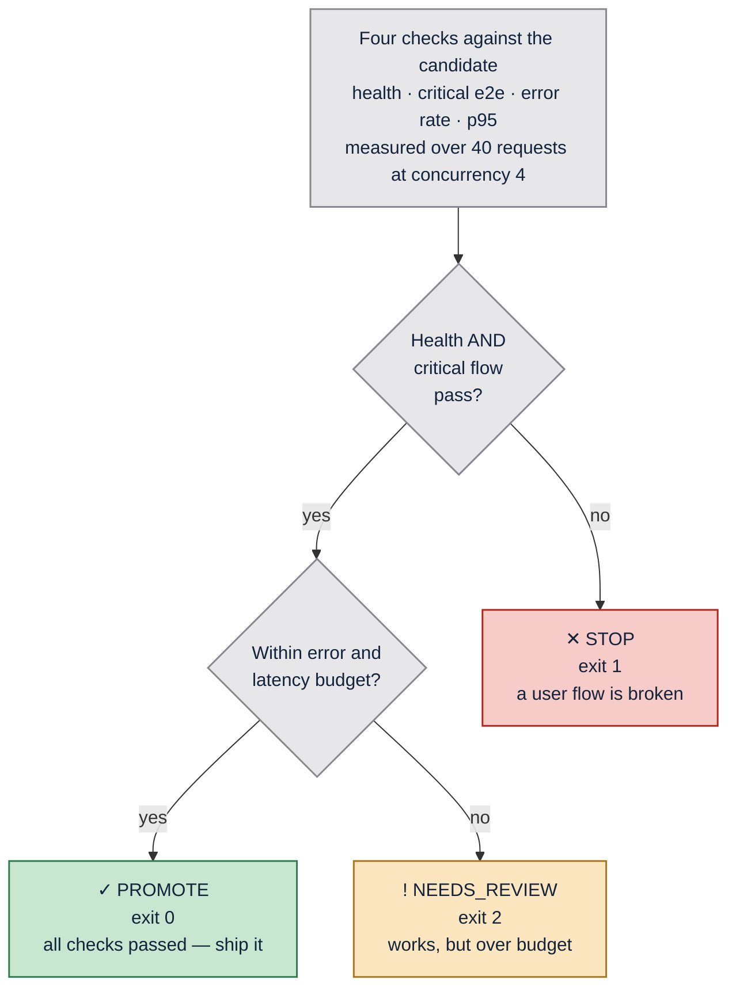
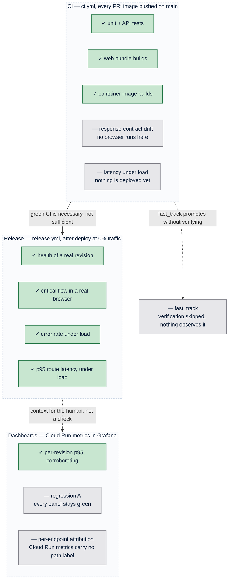

# Architecture

_Generated by the `architecture-doc` skill from `595e651` on 2026-08-18._

FleetNet Route Planner is a single-container fleet-routing dashboard: an Express
process that serves both a JSON routing API and the built React bundle, deployed
as one Cloud Run service. The routing itself is deterministic and fake, which
makes every end-to-end assertion exact rather than approximate.

The application is scenery. The architecture that matters is the **release
gate**: a candidate revision deploys at 0% traffic, gets verified against four
policy checks while real users are still served by the previous revision, and
only then is a named revision promoted by a human. The system is built to make
the difference between "the code compiles" and "the release is fit to ship"
structurally visible.

---

## Reading the diagrams

Color here is an encoding, not decoration. Two legends are in use, and every
diagram states which one applies. No diagram mixes them.

**What each channel carries:**

| Channel | Meaning |
| --- | --- |
| Blue family | We build and ship it — a PR can change it |
| Grey | Someone else's contract, or outside what the diagram asserts |
| Saturation within blue | Altitude: saturated = a deployable, pale = a module inside one |
| Green / amber / red | Release outcome only — `PROMOTE` / `NEEDS_REVIEW` / `STOP` |
| Solid edge | Runtime request path |
| Dashed edge | Build- or deploy-time action |

Grey is the one hue shared by both legends, because its meaning is identical at
both scales: outside the boundary of what the diagram asserts. Color is always
redundant — every colored node also carries a glyph or word, so the diagrams
survive grayscale printing and color-vision deficiency. Labels are plain text
with `\n` breaks and no HTML, so they render identically wherever Mermaid runs.
The full rules live in
`.claude/skills/architecture-doc/references/color-contract.md`.

---

## C1 — System context

_Legend S — hue = ownership. Solid = runtime request path; dashed = deploy-time action._

The release agent is drawn as an **actor**, not as infrastructure, because it
makes a decision: it runs the policy and produces a verdict. It is deliberately
*not* the actor that moves traffic. `scripts/promote.sh` refuses to promote an
unspecified latest revision, so promotion is always a named, human-issued act —
which is what keeps every action the agent takes reversible and invisible to
users.

| Element | Reality |
| --- | --- |
| Dispatcher | Browser user of the SPA |
| Release agent | `scripts/verify-release.mjs`, driven by a human or the `release.yml` job |
| Human approver | Runs `scripts/promote.sh REVISION`, or sets `auto_promote` on the workflow |
| FleetNet Route Planner | This repo — `server/` + `web/`, one image |
| GitHub Actions | `.github/workflows/ci.yml`, `.github/workflows/release.yml` |
| Artifact Registry | `northamerica-northeast1-docker.pkg.dev/warpdemo-505821/warpdemo/fleetnet-route-planner` |
| Google Cloud Run | Service `fleetnet-route-planner`, region default `northamerica-northeast1` |
| Cloud Monitoring | `run.googleapis.com/*` metrics, read by the Grafana stack in `grafana/` |

---

## C2 — Containers

_Legend S — hue = ownership; saturation = altitude. The dashed outlines mark containment, not a category._

Three boundaries, and the distinctions between them are load-bearing.
**Runtime** ships inside the image and serves users. **Release-time** exists only
to interrogate a candidate and is never deployed — which is why the verifier can
generate load and zero counters with no production blast radius. **Operator's
machine** is context for a human: it observes, it never gates. Only the
dashboards and compose file in `grafana/` are ours; Grafana and the query proxy
are stock images, so they are grey.

| Container | Path | Notes |
| --- | --- | --- |
| Web SPA | `web/src/` → `web/dist/` | Built in Dockerfile stage 1, copied into the runtime stage |
| API server | `server/src/` | Serves `/api/*`, `/health`, `/metrics`, `/metrics/prometheus`, and the SPA fallback |
| Release verifier | `scripts/verify-release.mjs` | Exits 0 / 1 / 2; writes `release-report.json` |
| Playwright | `e2e/route.spec.js`, `e2e/screenshots.spec.js` | `@critical` subset gates the release; `demo.spec.js` runs in its own project |
| Media capture | `scripts/capture-demo.mjs` | Visual evidence for PR comments and release artifacts |
| Dashboards | `grafana/dashboards/`, `grafana/docker-compose.yml` | `fleetnet-release` plus the `fleetnet-observability-firehose` contrast dashboard |

The API exposes two telemetry surfaces on purpose. `/metrics` is the compact
JSON contract the verifier consumes and must stay stable; `/metrics/prometheus`
carries richer bounded dispatch dimensions for a scrape that the current local
datasource deliberately does not perform.

---

## C3 — Components inside the container

_Legend S — every module is pale blue because all of them live inside one already-owned container. Nothing here is independently deployable._

Note what is **not** colored: `api.js` is where the response-contract regression
surfaces, and it would be tempting to paint it red. That would be a legend
violation — red means `STOP` in this document, and this is a structural diagram.
The significance goes in the table instead.

| Component | Responsibility | Why it matters to the release gate |
| --- | --- | --- |
| `web/src/api.js` | Validates that `distance_miles`, `duration_minutes`, `status` are present | Turns a silent schema drift into a thrown error the browser test can see — this is where regression A becomes visible |
| `web/src/App.jsx` | Lane form with origin and destination constrained to a fixed location list, results, 15s health poll, deployed commit in the header | The `data-testid` hooks Playwright asserts against |
| `server/src/app.js` | Express wiring, structured JSON logs, release identity in `/health` and `/metrics`; `ROUTE_DELAY_MS` injects upstream latency | The knob that reproduces regression B without a code change |
| `server/src/routeEngine.js` | Deterministic routing — seeded lanes plus FNV-1a fallback, vehicle multipliers, service-level buffer, dispatch risk | Determinism is what lets e2e assert `312 mi / 338 min` and an `8h 38m` SLA exactly |
| `server/src/metrics.js` | In-process counters, percentiles over a 500-sample window, bounded dispatch profiles, Prometheus exposition | The entire observability stack the policy needs — no external APM |
| `server/src/index.js` | Binds `PORT`, logs release id, image tag, configured delay | Cloud Run injects `PORT`; that log line is the first evidence a revision started |

Two rules the policy depends on. Only 5xx responses count as errors — a `400`
from a rejected bad request is the API working correctly, and counting it would
make validation coverage look like an outage. And dispatch-profile labels are
deliberately low-cardinality (`vehicle_type`, `service_level`, distance and
traffic bands, `status`, `dispatch_risk`); lane names never become labels.

---

## Deployment and traffic topology

_Legend S — hue = ownership. Solid = live traffic; dashed = a deliberate operator action._

A candidate is reachable and fully real, but receives **zero** user traffic. It
has its own tagged URL, which is the `BASE_URL` the verifier and Playwright run
against. A failing candidate costs nothing to abandon — it is left at 0% and
production never noticed.

Deploy identity is the immutable image tag, not the source tree. `deploy.sh`
requires an `IMAGE_REF` ending in a `git-FULLSHA` tag and exits rather than
deploy anything else; it derives the short SHA, uses it as the Cloud Run revision
suffix, and passes it into the container as `RELEASE_VERSION` and `IMAGE_TAG`.
The same short SHA then appears in `/health`, in `/metrics`, in the UI header,
and in the revision name a Grafana row is keyed by — so a dashboard row maps back
to a deployed image with no external lookup.

`promote.sh` takes the revision name to serve and shifts 100% of traffic to it.
Given no argument it exits 2 rather than guessing at "latest". Rollback is the
same command pointed at a known-good revision, which is why rollback needs no
separate rehearsal.

---

## The release gate

Four checks run against the deployed candidate. The verdict is a function of
**which** checks failed, not how many.

_Legend R — hue = verdict. Each node carries its glyph and exit code, so the diagram and the shell agree._

The amber branch is the design point. A slow-but-working candidate is a judgment
call a human might reasonably override; a broken user flow is not. Collapsing
both into a single "failed" would delete that distinction and force every
release into a binary an agent cannot reason about.

| Check | Threshold | Source |
| --- | --- | --- |
| Health | `status: "ok"` | `GET /health` |
| Playwright critical flow | all `@critical` specs pass | Real browser against the candidate URL |
| Error rate | < 1%, override `POLICY_MAX_ERROR_RATE` | `GET /metrics` → `error_rate` |
| p95 route latency | < 750 ms, override `POLICY_MAX_P95_MS` | `GET /metrics` → `route_latency_ms.p95` |

`release-report.json` writes a `checks` object whose keys map one-to-one onto
these rows, so a downstream agent branches on data rather than parsing output.
`details.metrics` additionally carries `dispatch_profiles` — evidence for a human
or an agent to reason about, deliberately not a fifth check.

---

## What each stage can and cannot see

This is the argument the whole repository exists to make.

_Legend R — green = caught at this stage; grey = structurally invisible to it. The grey nodes are the payload._

Playwright is **deliberately absent from CI**. It is not an oversight to fix —
running it pre-merge against a dev server would prove something about a localhost
process, not about the artifact that will serve users. Pushing an image to
Artifact Registry on `main` is likewise not a release: that image has passed unit
tests and nothing else.

The dashboards are the second blind spot, and the more interesting one. They read
Cloud Run's built-in metrics, which are edge-to-edge and per-revision, so they
answer "is the service up and fast?" and cannot answer "is this candidate fit to
promote?". Under regression A the service is up, fast, and returning 200s while
the product is broken; the `fleetnet-observability-firehose` dashboard exists to
make that contrast visible.

`fast_track` on `release.yml` deploys and promotes with verification skipped
entirely. It is a development convenience, and it is grey because it asserts
nothing — a release taken through it has no evidence behind it at all.

The two specified regressions both exploit the CI gap:

| | Regression | CI | Deploy | Verdict |
| --- | --- | --- | --- | --- |
| **A** | `duration_minutes` renamed to `duration` | green | green | `STOP` — `api.js` throws, the browser test sees it |
| **B** | ~2.5 s upstream latency (`ROUTE_DELAY_MS=2500`) | green | green | `NEEDS_REVIEW` — p95 blows the budget |

Both are green through every pre-merge check and deploy successfully. Only a
post-deployment gate catches them.

---

## Where things live

| Path | Responsibility |
| --- | --- |
| `server/src/routeEngine.js` | Deterministic fake routing, service-level policy, dispatch risk |
| `server/src/metrics.js` | In-process counters, latency percentiles, dispatch profiles, Prometheus exposition |
| `server/src/app.js` | Express app — API, telemetry endpoints, static SPA, structured logs |
| `server/src/index.js` | Process bootstrap, binds `PORT`, logs release identity |
| `web/src/App.jsx` | The dashboard |
| `web/src/api.js` | Response-contract validation |
| `e2e/route.spec.js` | `@critical` release-gating specs |
| `e2e/screenshots.spec.js` | `@screenshot` visual evidence that also asserts |
| `e2e/demo.spec.js` | Recorded walkthrough, its own Playwright project |
| `scripts/verify-release.mjs` | The release gate |
| `scripts/verify-local.sh` | Full rehearsal against a local container, no GCP |
| `scripts/deploy.sh` | Candidate deploy at 0% traffic from an immutable image tag |
| `scripts/promote.sh` | Promote or roll back a named revision |
| `scripts/capture-demo.mjs` | Screenshots and walkthrough video into `media/` |
| `grafana/` | Local Grafana over Cloud Monitoring — dashboards, datasource, compose stack |
| `.github/workflows/ci.yml` | Pre-merge checks, image push on `main`, visual preview comment |
| `.github/workflows/release.yml` | Deploy → verify → optionally promote |
| `docs/` | Spec, release policy, deployment, GCP setup, regression playbook |
| `NORTHSTAR.md` | Why the demo exists and what the agent is meant to own |

---

## Key decisions

_Hand-authored. The `architecture-doc` skill never rewrites this section._

**Routing is fake and deterministic.** The same inputs always produce the same
numbers, which lets end-to-end tests assert exact values (`312 mi / 338 min`)
instead of ranges. A flaky assertion in a release gate is worse than no gate —
it trains people to re-run until green.

**One container, not two.** Express serves both the API and the built SPA, so
there is one Cloud Run service, one URL, and no CORS. The cost is that the web
and API cannot scale independently; at this size that trade is obviously right,
and splitting later is a Dockerfile change plus a traffic rule.

**Telemetry is in-process, not an APM.** `metrics.js` is ~90 lines and exposes
exactly what the policy needs over HTTP. A release agent can `curl /metrics` and
decide, with no vendor, no credentials, and no ingestion delay between the load
being generated and the number being readable.

**`/metrics/reset` exists so p95 means something.** Without it, percentiles from
a long-lived revision would be dominated by warm-up noise, and the gate would
measure history rather than this candidate.

**Verdicts are three-valued, and the exit codes carry them.** 0 / 2 / 1 map to
`PROMOTE` / `NEEDS_REVIEW` / `STOP` so a shell, a CI step, and an agent can all
branch on the same signal without parsing text.

**Candidates deploy at 0% traffic.** Verification runs against a real revision on
real infrastructure while users are still served by the previous one. This is
what makes a failed verification cheap: the fix is to do nothing.
