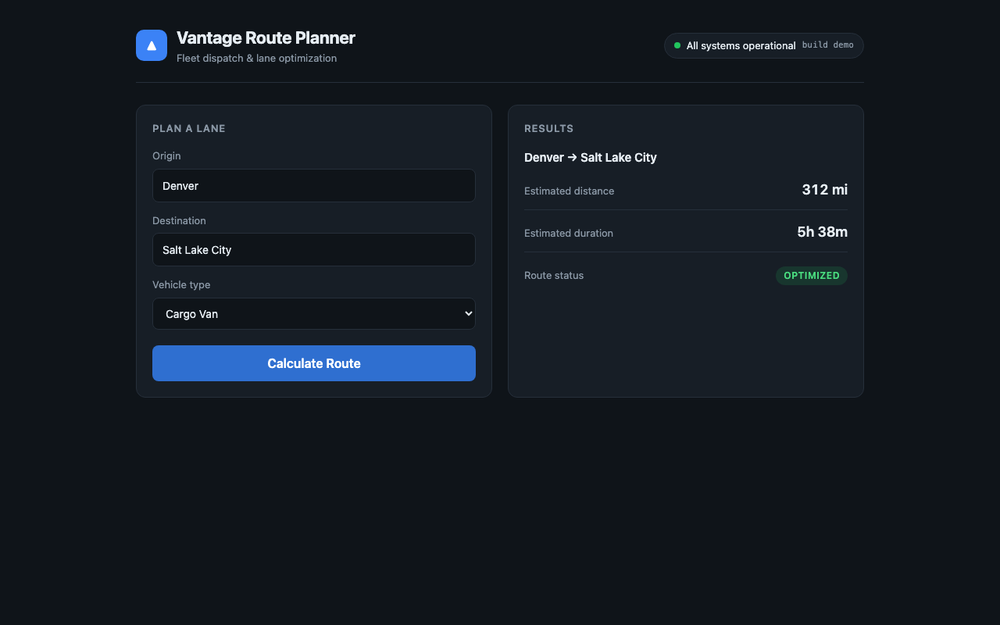

# Vantage Route Planner

A small fleet-routing dashboard that exists to be **deployed, verified, and
intentionally broken**. It is the target application for a release-agent demo:
something realistic enough that a deploy/verify/promote decision means
something, small enough that the whole thing fits in your head.



The app is scenery. The interesting part is [the release gate](#release-gate).

---

## Quick start

```bash
npm run install:all   # root + server + web
npm test              # unit + API tests
npm run dev           # API on :8080, Vite on :5173
```

Full release rehearsal against a real container — no GCP needed:

```bash
./scripts/verify-local.sh
```

```
1. Health check
   PASS  status=ok version=1caaa46
2. Load generation (40 requests, concurrency 4)
   issued=40 failures=0 client p95=19ms
3. Server telemetry
   PASS  error rate 0.00% (threshold < 1.00%)
   PASS  p95 route latency 0.69ms (threshold < 750ms)
4. Playwright critical flow
   PASS  critical specs (0 failed)

Verdict
   PROMOTE — All release policy checks passed.
```

---

## What it does

Enter an origin, a destination, and a vehicle type; get back distance, duration,
and a route status. Routing is **fake and fully deterministic** — the same inputs
always produce the same numbers, which is what makes the end-to-end tests exact
rather than approximate.

The canonical demo lane is `Denver → Salt Lake City`: **312 mi / 338 min** on a
cargo van. Heavier vehicles apply a multiplier (semi = 1.15×, so 389 min).
Lanes outside the seeded table get stable pseudo-values from a string hash.

### API

| Endpoint | Purpose |
| --- | --- |
| `POST /api/route` | Calculate a route |
| `GET /health` | Liveness + running version |
| `GET /metrics` | Request count, error rate, route latency percentiles |
| `POST /metrics/reset` | Zero the counters before a measurement run |

```bash
curl -s localhost:8080/api/route \
  -H 'Content-Type: application/json' \
  -d '{"origin":"Denver","destination":"Salt Lake City","vehicle_type":"van"}'
```

```json
{
  "distance_miles": 312,
  "duration_minutes": 338,
  "status": "optimized",
  "vehicle_type": "van",
  "lane": "Denver → Salt Lake City"
}
```

Validation errors return `400`. Only 5xx counts against the error budget — a
rejected bad request is the API working correctly.

---

## Release gate

The demo's whole argument is this split:

| Stage | What runs | Catches |
| --- | --- | --- |
| **CI** (`ci.yml`) | unit + API tests, web build, container build | broken code |
| **Release** (`release.yml`) | Playwright, health, error rate, p95 latency | broken *releases* |

**Playwright is deliberately not in CI.** It runs post-deployment against a real
candidate revision. That gap is the point: a PR can be green, build clean, deploy
successfully, and still be unfit to promote.

### Policy

| Check | Threshold |
| --- | --- |
| Playwright critical flow | PASS |
| Error rate | < 1% |
| p95 route latency | < 750 ms |
| Health check | PASS |

### Verdicts

| Verdict | Exit | Meaning |
| --- | --- | --- |
| `PROMOTE` | 0 | Ship it |
| `NEEDS_REVIEW` | 2 | Works, but over budget on latency or errors |
| `STOP` | 1 | Health or critical user flow failed |

`npm run verify` writes `release-report.json` with a `checks` object that maps
one-to-one onto the policy rows, so an agent can branch on it directly.

See [docs/release-policy.md](docs/release-policy.md).

---

## Deployment

Single container — Express serves both the API and the built React bundle, so
there is one Cloud Run service and one stable URL.

Candidates deploy at **0% traffic** with their own tagged URL. Production keeps
serving the previous revision until something explicitly promotes:

```bash
export GCP_PROJECT=your-project-id

./scripts/deploy.sh                        # candidate at 0% traffic, prints its URL
BASE_URL=<candidate url> npm run verify    # 0 PROMOTE / 1 STOP / 2 NEEDS_REVIEW
./scripts/promote.sh                       # 100% traffic — only after PROMOTE
./scripts/promote.sh <revision>            # or roll back
```

A bad candidate never receives user traffic. See
[docs/deployment.md](docs/deployment.md) for GCP setup and CI credentials.

---

## Tests

```bash
npm test              # 19 unit + API tests (vitest + supertest)
npm run test:e2e      # full Playwright suite
npm run test:critical # release-gating specs only
npm run capture       # screenshots + walkthrough video -> media/
```

`npm run capture` produces visual evidence of a running candidate — useful for
PR comments and demo decks:

https://github.com/TryHarder01/release-agent-demo/raw/main/docs/media/demo-walkthrough.webm

---

## Breaking it on purpose

Two regressions are specified but **not yet implemented** — see
[docs/regressions.md](docs/regressions.md):

| | Regression | CI | Deploy | Verdict |
| --- | --- | --- | --- | --- |
| **A** | `duration_minutes` → `duration` | green | green | `STOP` — Playwright catches it |
| **B** | ~2.5 s upstream latency | green | green | `NEEDS_REVIEW` — p95 blows the budget |

Regression B needs no code change — the `ROUTE_DELAY_MS` knob is already on `main`:

```bash
ROUTE_DELAY_MS=2500 ./scripts/verify-local.sh
```

```
PASS  error rate 0.00% (threshold < 1.00%)
FAIL  p95 route latency 2508.49ms (threshold < 750ms)
PASS  critical specs (0 failed)

NEEDS_REVIEW — Functionality is healthy but the release budget was exceeded: p95_latency.
```

Both verdicts are verified against a real container.

---

## Layout

```
server/src/routeEngine.js   deterministic fake routing
server/src/metrics.js       in-process counters + latency percentiles
server/src/app.js           Express app (API + static SPA)
web/src/App.jsx             the dashboard
web/src/api.js              response-contract validation — where regression A surfaces
e2e/route.spec.js           @critical release-gating specs
e2e/demo.spec.js            recorded walkthrough
scripts/verify-release.mjs  the release gate
scripts/deploy.sh           candidate deploy at 0% traffic
scripts/promote.sh          promote / roll back
docs/                       policy, deployment, regression playbook
```

## Stack

React 18 + Vite · Express 4 · Vitest + Supertest · Playwright · Docker · Cloud Run
