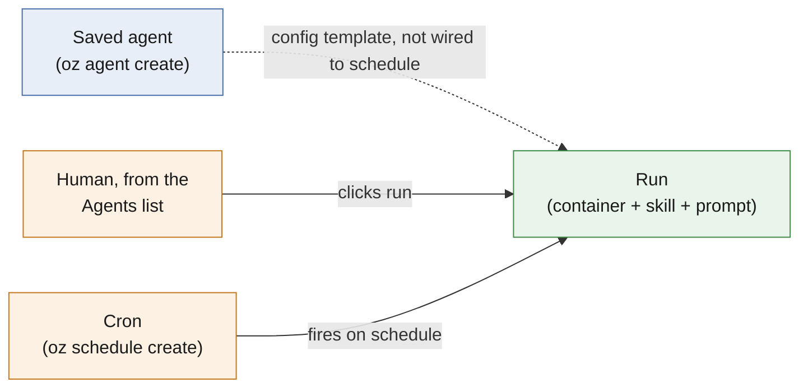
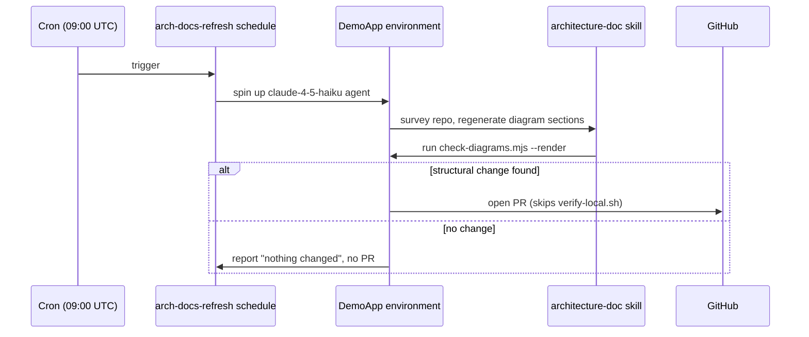

# Oz agents, runs, and schedules

Three separate `oz` primitives look related but don't reference each other in
the current CLI. Warp's own UI adds to the confusion: it's called "Agents,"
but most of what's in that list never executes on its own.

## The three primitives

| Primitive | Created with | Holds config? | Executes automatically? |
| --- | --- | --- | --- |
| **Saved agent** | `oz agent create` | Yes — prompt, skills, model, environment, secrets | No — someone has to click run |
| **Run** | `oz agent run` / `run-cloud` | No — config passed inline, once | N/A — it *is* the execution |
| **Schedule** | `oz schedule create` | Yes — same fields as a saved agent, plus a cron string | Yes — fires on its own |

A saved agent and a schedule store almost the same fields. The difference is
who or what triggers execution: a saved agent waits for a human to pick it
from the Agents list; a schedule fires on a cron clock without anyone present.

**Legend:** blue = stored configuration, orange = trigger, green = the actual
execution. The dotted line is deliberate. `oz schedule create` takes its own
`--prompt` / `--skill` / `--model` / `--environment` flags and has no
`--agent-id`. A saved agent is not a template a schedule can point at; the two
are parallel, independent ways to define the same shape of config.

## Why a saved agent exists at all

From [Warp's docs](https://docs.warp.dev/agent-platform/cloud-agents/oz-web-app/):
a saved agent is a reusable config that a team browses and runs by hand,
attributed to the agent's own identity rather than to whoever clicked the
button. It solves consistency across manual runs: everyone gets the same
prompt, skill, and model instead of retyping them. It does not solve
automation; that's the schedule's job.

## What we built: `arch-docs-refresh`

Goal: refresh `ARCHITECTURE.md` daily, using the `architecture-doc` skill,
without the full release-verification gate. (`verify-local.sh` builds a
container and runs Playwright, which a docs-only diff doesn't need.)

We used a schedule, not a saved agent, because the requirement was a cron
trigger, not a button teammates can click. Nothing stops adding a saved agent
later for ad hoc manual runs of the same config; it would need its own
`oz agent create` call and would still not be invoked by the schedule.

| Field | Value |
| --- | --- |
| Schedule ID | `0AfZO6qE8hzFgzSnrXukJw` |
| Cron | `0 9 * * *` (daily, 09:00 UTC) |
| Model | `claude-4-5-haiku` — cost-efficient; the task is mechanical, not reasoning-heavy |
| Skill | `TryHarder01/release-agent-demo:architecture-doc` |
| Environment | `DemoApp` (team-scoped) |
| Guard | Skips `verify-local.sh` / Docker / Playwright; skips opening a PR if nothing changed |

Manage it with `oz schedule get / pause / unpause / update / delete
0AfZO6qE8hzFgzSnrXukJw`.
