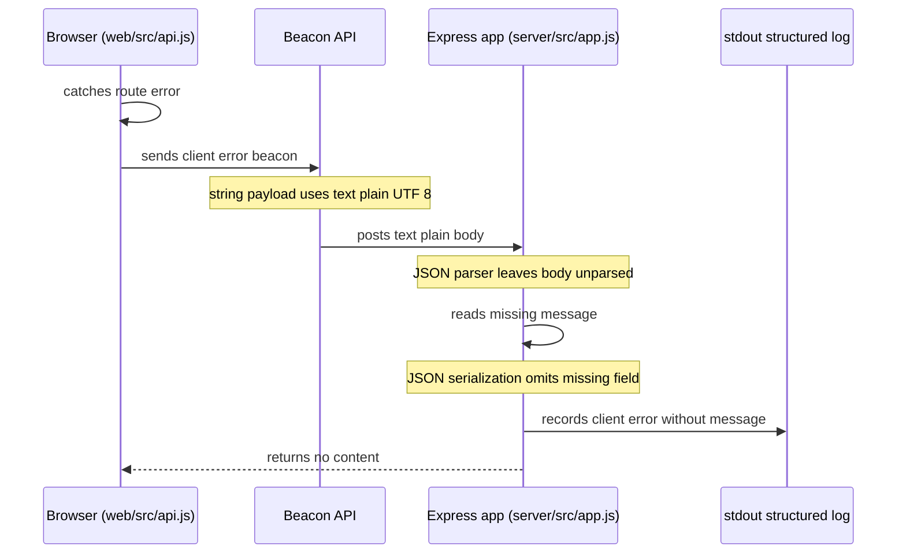

# Investigation: client-error beacon reports lose the original browser error message

_Investigated: 2026-08-18 · Scope: `web/src/api.js`, `server/src/app.js` on `main` (local, no deployed candidate)_

**Question from Observability**: "When the FleetNet route UI detects a malformed route response, it calls `navigator.sendBeacon` to POST `/client-error`. Our log pipeline sometimes receives `client_error` events without a useful message. Does FleetNet preserve the original browser error message into the structured server log; if not, where does it get lost?"

## Conclusion

No — the original browser error message is lost before it reaches the structured log, on every real browser call. **Confidence: high**, based on a direct reproduction below, not just code reading.

`navigator.sendBeacon(url, string)` always sends the payload with `Content-Type: text/plain;charset=UTF-8` — this is fixed Beacon API behavior when the second argument is a plain string, not a `Blob`; a string payload can never be sent as `application/json` (web/src/api.js:38, web/src/api.js:49). `express.json()` only parses bodies whose `Content-Type` matches `application/json` (server/src/app.js:28); a `text/plain` body is left unparsed, so `req.body` never contains the `message` field the client sent. `POST /client-error` reads `req.body?.message` (server/src/app.js:83), which is `undefined` in that case, and `JSON.stringify` silently omits object keys whose value is `undefined` (server/src/app.js:20), producing a `client_error` log line with `severity` and `event` but **no `message` key at all**.

**Impact**: every `client_error` event ever emitted by the real FleetNet frontend is missing `message`, because the frontend always calls `sendBeacon` with a plain string (never a `Blob`). This is not an intermittent condition — the code path guarantees it. The only reason the repo's own test suite doesn't show it is that it drives the endpoint through `supertest .send(object)`, which sets `Content-Type: application/json`, a request shape the real browser can never produce for this call.

## Evidence

- `navigator.sendBeacon('/client-error', JSON.stringify({ message: err.message }))` — the second argument is a plain string built with `JSON.stringify`, not a `Blob`. (web/src/api.js:38, web/src/api.js:49)
- Per the Beacon API spec (mirrored by MDN and multiple independent write-ups), when `data` is a string, the browser sets the request's `Content-Type` to `text/plain;charset=UTF-8`; `application/json` is only used if the caller wraps the payload in a `Blob` with an explicit `type`. FleetNet's code never constructs a `Blob`.
- `app.use(express.json({ limit: '64kb' }))` is the only body-parsing middleware mounted (server/src/app.js:28). `express.json()` (body-parser) only parses requests whose `Content-Type` matches `application/json`; a `text/plain` request is passed through untouched.
- `app.post('/client-error', (req, res) => { logJson({ severity: 'ERROR', event: 'client_error', message: req.body?.message }); res.status(204).end(); });` (server/src/app.js:82-85) reads `req.body?.message`. If `req.body` was never populated by a parser, this is `undefined`.
- `logJson` writes `JSON.stringify({ ts: ..., ...fields })` (server/src/app.js:18-21). `JSON.stringify` drops any key whose value is `undefined`, so a `message: undefined` field never appears in the emitted line at all — the log doesn't even show `"message": null`, it shows nothing.
- **Reproduction (this run)**: posting the exact JSON string a browser would send, but with `Content-Type: text/plain;charset=UTF-8` (matching real `sendBeacon` semantics) against a `createApp()` instance produced this structured log line, captured verbatim from `process.stdout.write`:
  ```json
  {"ts":"2026-08-18T04:03:17.428Z","severity":"ERROR","event":"client_error"}
  ```
  No `message` key is present. HTTP response was `204` (silently accepted), so nothing downstream sees a failure either.
- **Contrast (existing repo test)**: `server/test/api.test.js:105-119` ("accepts a client error report and logs it") posts via `supertest .send({ message: ... })`, which sets `Content-Type: application/json`. Re-running that suite confirms it passes:
  ```
  ✓ test/api.test.js (14)
  Test Files  1 passed | 1 skipped (2)
  Tests  2 passed | 30 skipped (32)
  ```
  This test is not wrong, but it never exercises the `Content-Type` a real `sendBeacon()` call produces, so it cannot catch this gap — it asserts the happy path for a request shape the browser never sends to this endpoint.

## Trace

```mermaid
flowchart LR
  A["web/src/api.js<br/>calculateRoute() catch block"] -->|"sendBeacon(url, JSON.stringify(...))<br/>string payload"| B["Browser Beacon API<br/>forces Content-Type: text/plain"]
  B -->|"POST /client-error<br/>text/plain body"| C["server/src/app.js:28<br/>express.json() middleware"]
  C -->|"Content-Type mismatch<br/>body left unparsed"| D["server/src/app.js:82<br/>POST /client-error handler<br/>req.body?.message = undefined"]
  D -->|"logJson({message: undefined, ...})"| E["server/src/app.js:18-21<br/>JSON.stringify drops undefined keys"]
  E --> F["Structured log line<br/>client_error event, NO message field"]
```



## Sequence



## Reproduce

Prerequisites: repo checked out, `npm run install:all` already run so `server/node_modules` has `supertest` and `express`. No network, no deployed candidate, no product code changes required.

Preferred check first — does an existing focused test already distinguish `text/plain` from the JSON case?
```bash
npm --prefix server test -- -t "client-error"
```
Expected/actual: 2 tests pass, both via `supertest .send(object)`, which is always `application/json`. Neither existing test sets `Content-Type: text/plain`, so none of them distinguishes the real browser request shape from the JSON one — hence the one-off script below.

One-off reproduction actually used in this investigation (mirrors real `sendBeacon` semantics exactly: JSON-shaped string body, `text/plain` Content-Type). No background server, no `nohup`, no nested quotes — a small script file imports `createApp` and `supertest` directly and is run once with `node`:
```js
// server/tmp-repro-client-error.mjs (temporary, not committed)
import request from 'supertest';
import { createApp } from './src/app.js';

const app = createApp({ staticDir: '/nonexistent-so-static-is-skipped' });
const lines = [];
const originalWrite = process.stdout.write.bind(process.stdout);
process.stdout.write = (chunk) => { lines.push(chunk.toString()); return true; };

// This is exactly what navigator.sendBeacon(url, string) sends on a real
// browser: a JSON-shaped string body, but Content-Type text/plain, never
// application/json (string payloads cannot carry a custom Content-Type).
const payload = JSON.stringify({ message: 'Malformed route response: missing duration_minutes' });
const res = await request(app)
  .post('/client-error')
  .set('Content-Type', 'text/plain;charset=UTF-8')
  .send(payload);

process.stdout.write = originalWrite;
console.log('status:', res.status);
console.log('log line:', lines.find((l) => l.includes('client_error')));
```
Run with:
```bash
node server/tmp-repro-client-error.mjs
```
Expected and actually observed:
```
status: 204
log line: {"ts":"2026-08-18T04:03:17.428Z","severity":"ERROR","event":"client_error"}
```
No `message` key is present in the captured log line.

Cleanup: the script only sends an in-process HTTP request to a `createApp()` instance — it starts no server process and touches no external state. The script itself was deleted after use and is not part of this change; it is reproduced above so the check can be re-run without re-deriving it.

## What seems amiss

- **Fact:** `sendBeacon` with a string payload is always `text/plain`; FleetNet's client code never builds a `Blob`, so it can never produce `application/json` for this call. (web/src/api.js:38,49)
- **Fact:** the server's only JSON body parser ignores non-`application/json` requests, and the `/client-error` handler has no fallback parser for `text/plain` or raw bodies. (server/src/app.js:28,82-85)
- **Fact:** `JSON.stringify` silently drops `undefined`-valued keys, so the failure mode is not a malformed or truncated `message` — it is a completely absent key, which is harder to notice in a log pipeline than an empty string would be. (server/src/app.js:18-21)
- **Inference (confidence: high):** this fully explains the Observability team's report. It is not intermittent or sampling-related — every real-browser `client_error` beacon takes this path, because the frontend has no code path that would ever attach `application/json` to a `sendBeacon` call. Any `client_error` line that *does* have a message today was not sent by a real browser via this integration (e.g. it came from a test, a manual `curl` with `application/json`, or a different caller).
- **Inference (confidence: medium):** the gap is invisible in CI because `server/test/api.test.js`'s `client-error` tests use `supertest`'s object-body helper, which defaults to `application/json` and therefore never exercises the Content-Type a real beacon sends. The tests are correct about the code they exercise; they simply don't exercise the browser's actual request shape.

## Next looks

- Confirm in a real browser's Network panel (or a packet capture) that a production `sendBeacon('/client-error', JSON.stringify(...))` call shows `Content-Type: text/plain;charset=UTF-8` on the wire, to rule out any browser-version-specific deviation from spec. Needs: a running frontend build and a browser, not available in this text-only environment.
- Check whether any `client_error` log lines in Cloud Logging *do* contain a `message` field, and if so, identify their source (test traffic, synthetic checks, a different integration) versus real user sessions, to confirm the 100%-loss theory rather than a partial one. Needs: Cloud Logging query access, out of scope for this local-only investigation.
- If a fix is desired, evaluate the two standard remedies named across the sources reviewed — send a `Blob` with an explicit `application/json` type from the client, or add a `text/plain`/raw body parser on the server keyed on this route — and decide which is more consistent with the "don't weaken the contract" posture already established for `web/src/api.js`. Not attempted here: this task is diagnosis only, no product code was changed.
