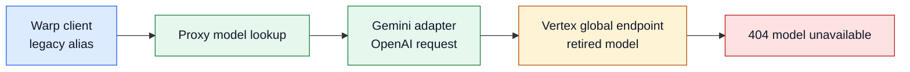
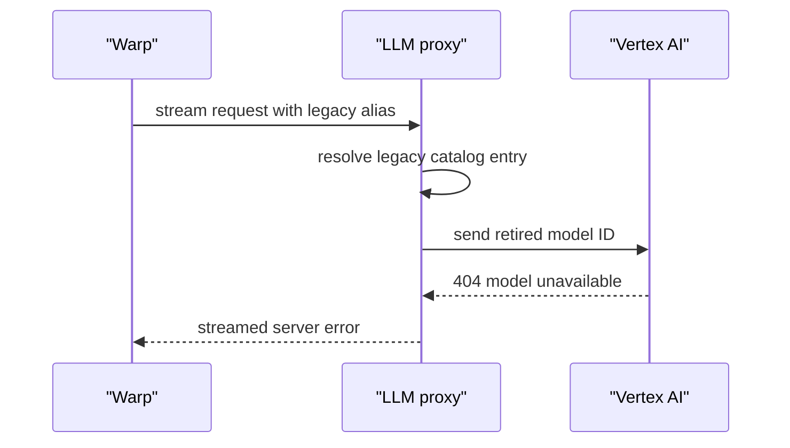

# Investigation: LLM proxy retired Gemini model

_Investigated: 2026-08-18 · Scope: manually deployed Cloud Run proxy; deployed revision unknown_

## Conclusion

The second advertised model is retired, not incorrectly authenticated or misrouted. The proxy accepts `vertex-gemini-2-0-flash-lite` and forwards `google/gemini-2.0-flash-lite` to Vertex's global OpenAI-compatible endpoint. Google retired that model on June 1, 2026; retired model requests normally return 404. This exactly matches the streamed Vertex error. Confidence: high.

Keep `vertex-gemini-3-1-flash-lite` unchanged. Replace the retired second offering with `vertex-gemini-3-5-flash-lite` targeting `google/gemini-3.5-flash-lite`, then update the test and Warp setup text. Google lists that low-cost model on the global endpoint.

## Evidence

| Observation | Source | What it establishes |
| --- | --- | --- |
| The second alias targets `google/gemini-2.0-flash-lite` in `global`. | `llmProxy/src/config.ts:10` | The failing model ID and location are hard-coded. |
| The adapter posts that target as `model` to the global OpenAI Chat Completions endpoint. | `llmProxy/src/adapters/gemini.ts:9`, `llmProxy/src/adapters/gemini.ts:13` | The response is from Vertex, after proxy validation. |
| The server selects the configured alias and forwards it. | `llmProxy/src/server.ts:38`, `llmProxy/src/server.ts:46` | There is no alias mismatch in the proxy. |
| Gemini 2.0 Flash-Lite retired on June 1, 2026; retired IDs normally return 404. | [Google model lifecycle](https://docs.cloud.google.com/gemini-enterprise-agent-platform/models/model-versions) | The upstream status and error are expected for this retired model. |
| Google lists Gemini 3.5 Flash-Lite on the global endpoint; its OpenAI compatibility guide establishes the `google/<model-id>` transport convention. | [Global endpoint locations](https://docs.cloud.google.com/gemini-enterprise-agent-platform/resources/locations), [OpenAI compatibility](https://docs.cloud.google.com/gemini-enterprise-agent-platform/models/start/openai) | The recommended replacement fits this proxy's existing location and transport. |

## Trace



Legend: blue is the caller, green is proxy code, amber is the external dependency, and red is the observed failure.

## Sequence



## Reproduce

Prerequisites: deployed proxy URL and a valid proxy API key. This checks the deployed path without exposing the key in shell history.

```bash
read -r -s WVP_KEY
export WVP_KEY
curl -NsS "https://YOUR_SERVICE_URL/v1/chat/completions" \
  -H "Authorization: Bearer $WVP_KEY" \
  -H 'Content-Type: application/json' \
  --data '{"model":"vertex-gemini-2-0-flash-lite","stream":true,"messages":[{"role":"user","content":"Reply with OK."}]}'
unset WVP_KEY
```

Expected: an SSE error containing Vertex's 404 for `google/gemini-2.0-flash-lite`.

After the patch and deployment, run the same command with `vertex-gemini-3-5-flash-lite`; expected result: normal streamed completion followed by `data: [DONE]`.

## What seems amiss

- **Fact:** The catalog and its test assert a Gemini 2.0 Flash-Lite target that Google has retired. `llmProxy/src/config.ts:10`; `llmProxy/test/gemini.test.ts:10`.
- **Inference (confidence: high):** The fixture's fixed model catalog has no lifecycle maintenance path, so its intended two-model offering drifted out of service.
- **Patch:** Change the second catalog entry to `{ id: "vertex-gemini-3-5-flash-lite", target: "google/gemini-3.5-flash-lite", location: "global" }`; update the matching test, README, and `llmProxy/docs/spec.md`; bump `config.version`; redeploy; change the second Warp endpoint's model name and alias.
- **Compatibility note:** This intentionally removes the old Warp model name. Keeping that alias while silently targeting a different model would make the model picker misleading. If a transition is required, keep it temporarily as a clearly named compatibility alias and announce its target.

## Next looks

- Run the post-deploy stream test for both advertised models from the deployed URL. The checked-out environment has no installed `vitest`, and no Cloud Run URL, revision, or credentials were supplied, so live verification was not possible here.
- Add a deployed contract test that calls every catalog entry. The existing unit test only checks literal catalog values and would continue to pass after a Vertex retirement.
