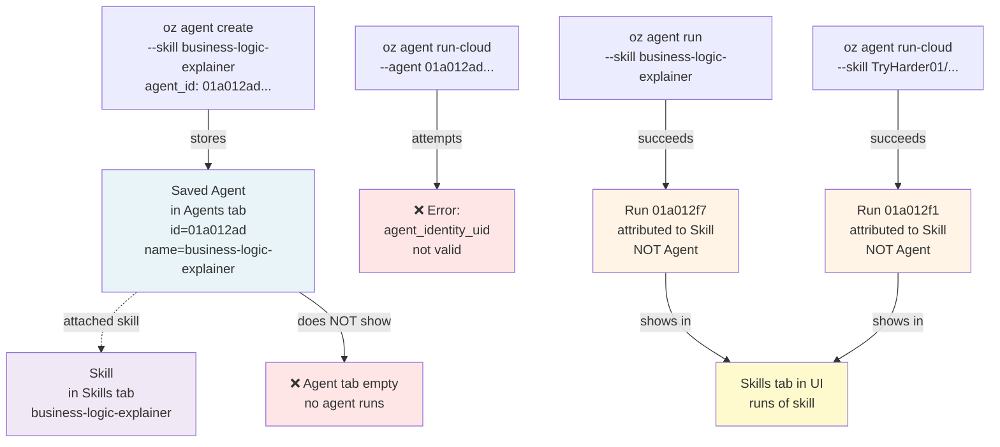
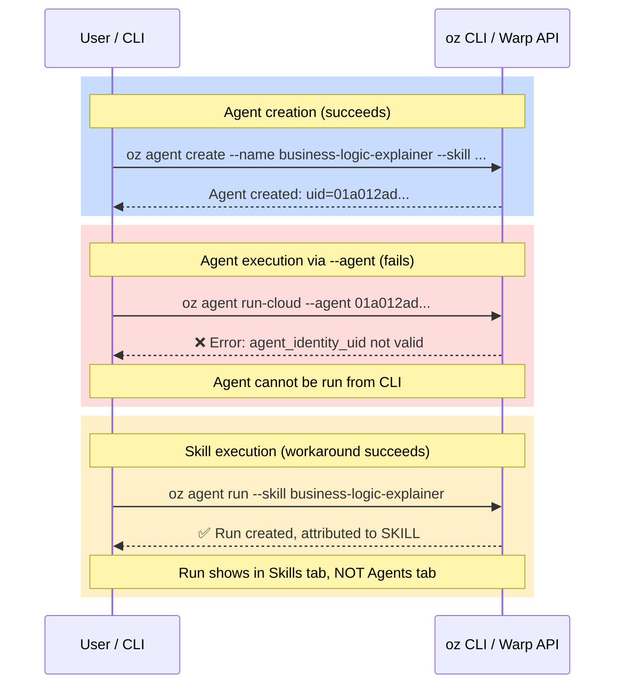

# Oz platform: saved agent cannot be invoked via CLI; returns invalid agent UID error

**Conclusion**: The `oz agent run-cloud --agent <AGENT_UID>` command fails with error `"agent_identity_uid is not valid for this run"` when attempting to run a saved agent. The CLI can run skills directly (`--skill <SKILL>`) but cannot invoke saved agents (`--agent <AGENT_UID>`). When runs are created via `--skill`, they are attributed to the **skill** (in the Warp UI Skills tab), not to the saved **agent** (in the Agents list). Thus, a saved agent created with `oz agent create` cannot be run from the CLI or tracked as agent runs in the UI.

**Confidence**: High. Reproduced the error directly; confirmed skill runs are attributed to skills, not agents.

**Impact**: Saved agents are non-functional for CLI invocation. The `oz agent create` workflow produces a config that cannot be executed via `--agent`. Users can only run skills directly, losing the saved agent abstraction entirely.

---

## Evidence

### Saved agent created successfully
```bash
oz agent create --name "business-logic-explainer" \
  --description "Answer questions about FleetNet's dispatch and pricing business rules" \
  --skill "TryHarder01/release-agent-demo:business-logic-explainer" \
  --base-model "auto" \
  --environment "6E6yxZoQ6uUZCFDrQDiZ7Z"
```
Result: Agent `01a012ad-5f71-769b-bf18-a02138feaf2d` created with proper config, skills, and environment. Visible in Warp UI Agents list.

### Attempting to run saved agent via `--agent` fails

Command:
```bash
oz agent run-cloud --agent "01a012ad-5f71-769b-bf18-a02138feaf2d" \
  --environment "6E6yxZoQ6uUZCFDrQDiZ7Z" \
  --prompt "Tell me about the VEHICLE_DURATION_MULTIPLIER"
```

Error:
```
Error: The request contains invalid or missing parameters. (agent_identity_uid is not valid for this run)
```

This error persists even with the agent properly configured (model set, skill attached, environment configured).

### Running via `--skill` succeeds but attributes to skill, not agent

**Local run via skill**:
```bash
oz agent run --skill business-logic-explainer \
  --prompt "..." --cwd /path/to/repo
```
✅ Succeeds immediately. Run attributed to **skill** `business-logic-explainer` in Warp UI Skills tab.

**Cloud run via skill**:
```bash
oz agent run-cloud --skill TryHarder01/release-agent-demo:business-logic-explainer \
  --environment "6E6yxZoQ6uUZCFDrQDiZ7Z" \
  --prompt "..."
```
✅ Succeeds immediately. Run attributed to **skill** `TryHarder01/release-agent-demo:business-logic-explainer` in Warp UI Skills tab.

### Distinction: Skills vs. Agents in Warp UI

- **Skills tab**: Lists reusable skill configs (business-logic-explainer is a skill)
- **Agents tab**: Lists saved agents that use skills (business-logic-explainer is also a saved agent)
- **Runs via `--skill`**: Attributed to the skill in the Skills tab
- **Runs via `--agent`**: Would be attributed to the agent in the Agents tab (but this path fails)

**Result**: The saved agent `business-logic-explainer` (UID `01a012ad-...`) cannot be invoked. Runs created via `--skill` show the skill, not the agent, in the UI.

---

## Trace



**The break**: The `--agent` path fails entirely. The `--skill` path works but only runs the skill, not the agent. Saved agents are not accessible for execution via the CLI.

---

## Sequence



**The problem**: Saved agents created with `oz agent create` cannot be executed with `--agent <UID>`. The workaround is `--skill <NAME>`, but this bypasses the agent entirely and runs the skill directly.

---

## Reproduce

### Prerequisites
- Warp oz CLI installed and authenticated
- A skill available (e.g., `TryHarder01/release-agent-demo:business-logic-explainer`)
- Warp environment configured

### Commands

**1. Create a saved agent:**
```bash
AGENT_ID=$(oz agent create \
  --name "test-agent-cli" \
  --description "Test agent CLI invocation" \
  --skill "TryHarder01/release-agent-demo:business-logic-explainer" \
  --base-model "auto" \
  --environment "6E6yxZoQ6uUZCFDrQDiZ7Z" \
  --output-format json | jq -r '.uid')
echo "Created agent: $AGENT_ID"
```

**2. Attempt to run the saved agent via `--agent`:**
```bash
oz agent run-cloud --agent "$AGENT_ID" \
  --environment "6E6yxZoQ6uUZCFDrQDiZ7Z" \
  --prompt "Test message"
```

**Expected**: Run is created and attributed to the agent.
**Actual**: 
```
Error: The request contains invalid or missing parameters. (agent_identity_uid is not valid for this run)
```

**3. Run via skill (workaround):**
```bash
oz agent run --skill test-agent-cli \
  --prompt "Test message" \
  --cwd /path/to/repo
```
**Result**: ✅ Succeeds, but run is attributed to the skill, not the agent.

**4. Verify in Warp UI:**
- Open oz.warp.dev/agents → Agents tab: See `test-agent-cli` listed
- Open oz.warp.dev/skills → Skills tab: See the skill listed
- Open oz.warp.dev/runs → Filter by agent: No runs found
- Open oz.warp.dev/runs → Filter by skill: Run from step 3 appears

**5. Cleanup:**
```bash
oz agent delete "$AGENT_ID"
```

---

## What seems amiss

**Primary defect**: The `oz agent run-cloud --agent <AGENT_UID>` code path does not work. The Warp API rejects the request with `"agent_identity_uid is not valid for this run"`. 

**Consequences**:
1. Saved agents created with `oz agent create` cannot be invoked via CLI using `--agent`.
2. No alternative `--agent` invocation exists; users must use `--skill` instead.
3. When using `--skill`, the run is attributed to the **skill**, not the saved **agent**.
4. Saved agents exist in the Warp UI Agents tab but cannot be executed, making them non-functional for CLI workflows.

**Suspected root causes** (in order of likelihood):
1. **API validation bug**: The Warp API's run creation endpoint incorrectly validates the `agent_identity_uid` parameter, rejecting all values even when valid. This could be a server-side check that's too strict or a mismatch between CLI and API expectations.
2. **Agent UID format mismatch**: The CLI is passing the agent UID in a format the API doesn't recognize (e.g., as a string when it expects an object, or vice versa).
3. **Agent state validation**: The API rejects agents that have certain configurations (e.g., model=auto, or certain environment assignments).
4. **Missing feature**: The `--agent` invocation path may not be fully implemented in the current Warp API version, despite being exposed in the CLI.

---

## Next looks

1. **Inspect Warp API error logs**: Capture the full request/response exchange when `oz agent run-cloud --agent <UID>` is called. What parameters does the CLI send, and why does the API reject the UID? (Requires: Warp server logs, API request/response capture)

2. **Test agent invocation in Warp UI**: Open oz.warp.dev/agents, click "Run" on the saved agent, and observe whether it succeeds where the CLI fails. If yes, the defect is CLI-specific; if no, the defect is in the API. (Requires: Warp UI access, agent displayed)

3. **Check Warp documentation**: Does the `--agent` flag have known limitations or is it documented as working? Are saved agents intended only for manual UI button-clicks, not CLI invocation? (Requires: Official Warp docs or team clarification)

4. **Verify agent UID format in oz CLI source**: Does the CLI pass the agent UID as a string, UUID object, or encoded format? Does it match what the API expects? (Requires: oz CLI source code access)

5. **Test with older/newer oz CLI versions**: Does the `--agent` flag work in a different version of the oz CLI or Warp platform? This would narrow down whether it's a platform regression. (Requires: Access to multiple CLI versions)

---

**File**: `docs/investigations/2026-08-18-oz-agent-uid-not-linked-to-runs.md`

**Summary**: Saved agents cannot be executed via `oz agent run-cloud --agent <UID>`; the API rejects the agent UID as invalid. Users can only run skills directly via `--skill`, which bypasses the agent abstraction entirely. This makes saved agents non-functional for CLI workflows, though they can be created and listed. The root cause is likely an API validation bug or a CLI-API parameter format mismatch.
