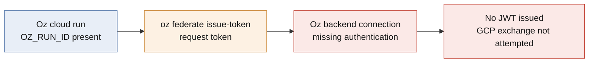
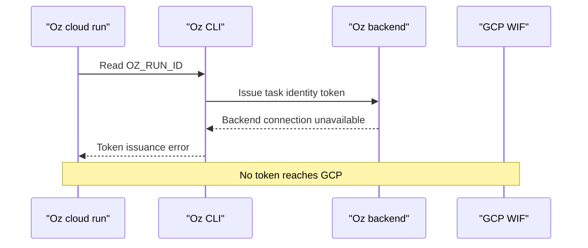

# Investigation: Oz federation token unavailable in cloud run

_Investigated: 2026-08-18 · Scope: `DemoApp GCP federation probe` (`fEjK6p65SDAZ1R9n4CPN84`), Oz cloud run on 2026-08-18_

## Conclusion

Oz advertises `federate issue-token`, but the isolated cloud run could not
obtain a token. The run had a valid `OZ_RUN_ID`; its Oz CLI instead reported
that it could not issue a task identity token. The run's sanitized diagnostic
identified missing authenticated backend connectivity and a failed WebSocket
connection. No GCP configuration change was attempted, so this does **not**
show that the Environment UI's GCP provider is required or misconfigured.

Confidence is high that the immediate blocker is Oz run connectivity, not a
missing run ID. Confidence is low on the underlying platform cause because
there is no backend-side trace or provider configuration record available.

The preceding probe also established a separate security issue: a team-scoped
GCP service-account-key secret was injected into the new environment and was
accidentally emitted in a run transcript. The exposed GCP key and the Oz secret
were revoked during incident containment. Until federation works, the Oz
readiness and on-call workflows cannot query GCP telemetry.

## Evidence

| Observation | Source | What it establishes |
| --- | --- | --- |
| The environment uses the custom image and the FleetNet repository, with no setup commands. | `oz environment get fEjK6p65SDAZ1R9n4CPN84` on 2026-08-18 | The reproduction did not depend on a repo setup command. |
| `oz federate issue-token` requires `--run-id`, `--audience`, and offers a default one-hour lifetime plus subject-template claims. | `oz federate issue-token --help` on 2026-08-18 | Oz has a federation-token feature intended for a running agent. |
| The clean probe found a nonempty, UUID-shaped `OZ_RUN_ID`, then `oz federate issue-token` returned `Unable to issue task identity token`. | [Oz run transcript](https://app.warp.dev/conversation/55a36da8-b280-4f29-98fe-09ca25ff0a4e) | The immediate failure is not caused by a missing run ID. |
| The run's sanitized diagnostic reports missing authenticated backend connectivity and a failing WebSocket connection. | [Oz run transcript](https://app.warp.dev/conversation/55a36da8-b280-4f29-98fe-09ca25ff0a4e) | Token issuance could not complete against Oz's backend. |
| The original design used a team `GCP_SA_KEY` injected at runtime. | [oz/README.md](../../oz/README.md#credentials) | A team secret was available to a fresh probe environment, not just the intended readiness agent. |
| The observability service account had only `roles/logging.viewer` and `roles/monitoring.viewer`; its user-managed key and the Oz team secret were removed after the exposure. | `gcloud iam service-accounts keys list` and `oz secret list` on 2026-08-18 | Containment removed the long-lived credential path; it did not grant any new GCP privilege. |

## Trace



Legend: blue = observed run context; orange = local CLI request; red = blocked
dependency or outcome.

## Sequence



## Reproduce

Prerequisites: authenticated Oz CLI, the probe environment ID above, and an
Oz cloud run with live backend connectivity. This is a token-issuance probe;
it does not create, modify, or authenticate to any GCP resource.

```bash
oz agent run-cloud \
  --environment fEjK6p65SDAZ1R9n4CPN84 \
  --name gcp-federation-claims-probe \
  --prompt 'Read OZ_RUN_ID only. Run oz federate issue-token with a harmless audience. Never print or save the token; report only whether issuance succeeded.'
```

Expected when the reported failure is present: the cloud-run transcript reports
`Unable to issue task identity token`; no JWT is shown or retained. A successful
result requires separately inspecting only token metadata and then testing a
dedicated, read-only GCP WIF provider.

## What seems amiss

- **Fact:** `oz federate issue-token` is present in the installed CLI, but it
  failed inside a valid Oz cloud run before GCP was contacted.
- **Fact:** the run diagnostic names absent authenticated backend connectivity
  and a failing WebSocket connection.
- **Inference (confidence: medium):** token issuance depends on an Oz
  cloud-run backend connection that was unavailable in this execution path.
- **Hypothesis (confidence: low):** the GCP provider UI may configure a
  prerequisite for Oz federation. The current evidence cannot distinguish that
  from a general Oz platform connection failure.

## Next looks

- Obtain an Oz platform/backend trace for run
  `01a01543-ccbc-74f5-a862-bae6ac31198a`, including why its task-identity
  request could not authenticate or maintain a WebSocket connection. Owner:
  Warp support or Oz platform operators.
- Inspect the probe environment's **GCP** UI panel and capture its fields and
  resulting configuration. Needed to determine whether it enables Oz token
  issuance or merely stores GCP credentials.
- After Oz can issue tokens, create a distinct GCP WIF provider and bind it
  only to the probe environment/agent subject and the existing read-only
  observability service account. Verify one Monitoring or Logging read and a
  denied Cloud Run mutation.
- Update [oz/README.md](../../oz/README.md) and
  [docs/demo-runbook.md](../demo-runbook.md) before the next demo: both still
  describe the removed `GCP_SA_KEY` path.
