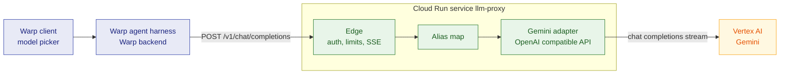
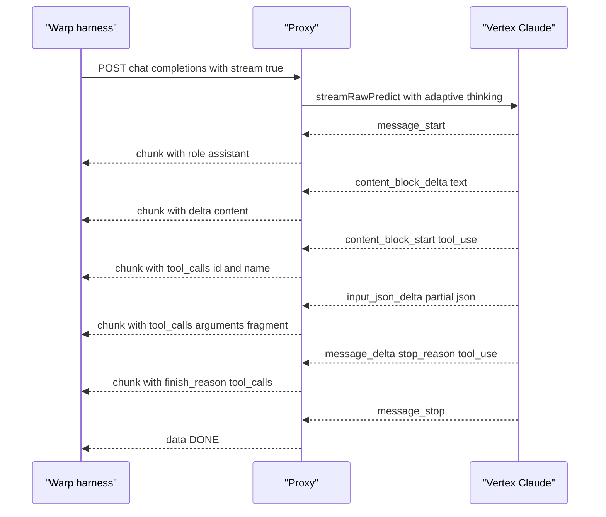

# Warp-to-Vertex inference proxy

Status: v1 is implemented as a deliberately narrow fixture. It serves two fixed
Gemini aliases, streams OpenAI Chat Completions responses, and gates access with
one Secret Manager-backed key. Gemini, non-streaming requests, key issuance,
and a CI/CD pipeline are out of scope.

## The one job

Warp's custom inference endpoint speaks exactly one protocol: the OpenAI Chat
Completions API at `POST /v1/chat/completions`. This service sends it to
Vertex AI's OpenAI-compatible Gemini endpoint. It holds a Google service
identity and forwards the stream.

For the demo the point is narrower than "a gateway": it puts a Vertex-billed
Gemini model in Warp's model picker, so a Warp agent runs against inference
that the GCP project pays for and logs.

Non-goals for v1: multi-tenant key issuance, a request cache, a fallback
router across providers, embeddings, and Warp Cloud Agents. That last one is
not a choice — Warp keeps user-level endpoint config on the device, so
cloud-hosted runs can't reach it.

## What each end forces on the design

| Warp requirement | Consequence for this service |
| --- | --- |
| OpenAI Chat Completions surface at `POST /v1/chat/completions` | The wire format is fixed. Every Anthropic or Gemini concept has to fit an OpenAI field or be dropped. |
| Reachable at a public HTTPS URL; `localhost` and private addresses are rejected | Cloud Run, not a laptop and not a tunnel. |
| Requests pass through Warp's backend, which holds the key only in flight | The endpoint is internet-facing and unauthenticated until it checks the bearer token itself. |
| The harness assembles system instructions, full conversation, and tool schemas server-side | Every turn resends a large stable prefix, which makes prompt caching the highest-value optimization. |
| The user types model identifiers into Warp settings | The alias namespace is ours to pick, and it has to stay stable once typed. |
| Responses stream back through Warp to the client | Server-sent events, unbuffered, for the whole life of a long tool-using turn. |
| Warp cannot enforce zero data retention through a custom endpoint | Retention becomes this service's responsibility to state and Vertex's to honor. |

## Upstream surface

| Model family | Vertex protocol | `model` value |
| --- | --- | --- |
| Gemini 3.1 Flash-Lite | OpenAI-compatible Chat Completions | In the body. Use `google/gemini-3.1-flash-lite`. |
| Gemini 3.5 Flash-Lite | OpenAI-compatible Chat Completions | In the body. Use `google/gemini-3.5-flash-lite`. |

Gemini's Vertex endpoint already uses the OpenAI Chat Completions shape. The
proxy replaces only the public model alias and the inbound API key with a
Vertex OAuth token.



Blue is Warp-operated, green is code in this directory, amber is
Google-operated. Each label names its operator, so the diagram survives
grayscale.

## Request forwarding, OpenAI to Gemini

| OpenAI field | Anthropic field | v1 behavior |
| --- | --- | --- |
| `messages[].role == "system"` | top-level `system` array | Concatenate in order. |
| `messages[].content` string or parts | `content` blocks | `image_url` with a data URL becomes a base64 `image` source; an `http` URL becomes a `url` source. |
| `messages[].tool_calls[]` | `tool_use` blocks | `arguments` is a JSON string on the OpenAI side and a parsed object on the Anthropic side. |
| `messages[].role == "tool"` + `tool_call_id` | `tool_result` block in a user message | Fold consecutive tool messages into one user message. Splitting them teaches Claude to stop calling tools in parallel. |
| `tools[].function` | `tools[]` | `parameters` becomes `input_schema`. |
| `tool_choice` | `tool_choice` | `auto` to `{type:"auto"}`, `required` to `{type:"any"}`, `none` to `{type:"none"}`, a named function to `{type:"tool", name}`. |
| `max_tokens` / `max_completion_tokens` | `max_tokens` | Required upstream. Default to 64000 when absent, since every call streams. |
| `stop` | `stop_sequences` | Direct. |
| `reasoning_effort`, `response_format` | — | Not supported in v1. |
| `parallel_tool_calls: false` | `disable_parallel_tool_use: true` | Direct. |
| `user` | `metadata.user_id` | Hash it rather than forward it. |
| `temperature`, `top_p`, `top_k` | dropped | Current Claude models reject sampling parameters. Drop them and count the drop as a metric. |
| `n > 1`, `logprobs`, penalties, `seed` | rejected | Return a 400 in the OpenAI error envelope. Silently ignoring `n` would return one choice where the caller expects several. |

Prompt caching and extended-thinking continuity are deferred. The fixture
demonstrates a tool-use stream, not a general-purpose Claude gateway.

## Stream translation



| Anthropic event | OpenAI chunk |
| --- | --- |
| `message_start` | first chunk, `delta.role = "assistant"` |
| `content_block_delta` / `text_delta` | `delta.content` |
| `content_block_delta` / `thinking_delta` | `delta.reasoning_content`, never `delta.content` |
| `content_block_start` for `tool_use` | `delta.tool_calls[i]` carrying `id` and `function.name` |
| `content_block_delta` / `input_json_delta` | `delta.tool_calls[i].function.arguments` fragment |
| `message_delta` | `finish_reason`, plus `usage` when the caller asked for it |
| `message_stop` | `data: [DONE]` |
| `ping` | SSE comment line, to keep the connection warm |
| mid-stream `error` | one chunk carrying an `error` object, then `[DONE]` |

Finish reasons map `end_turn` and `stop_sequence` to `stop`, `max_tokens` to
`length`, `tool_use` to `tool_calls`, and `refusal` to `content_filter`.

`pause_turn` is the interesting one. It means a server-side tool wants to
continue, and the OpenAI protocol has no way to express it. The adapter has to
resume the upstream call itself and keep the downstream stream open, so a
paused turn looks like one long response to Warp.

`reasoning_content` is not part of the OpenAI spec. Other OpenAI-compatible
proxies use it for the same purpose, and putting summarized reasoning in
`delta.content` instead would corrupt the assistant text that Warp feeds back
on the next turn. If Warp discards the field, the cost is a visible pause
before output, not a broken turn.

## What cannot round-trip

- **Thinking blocks.** Anthropic wants them echoed back unchanged on the next
  turn of the same model. Warp keeps only OpenAI-shaped history, so they never
  come back and interleaved reasoning continuity is lost. Vertex drops them
  silently rather than erroring.
- **Fast mode and server-side refusal fallbacks.** Neither exists on Vertex.
  A refusal surfaces as `content_filter` and stops there.
- **Web fetch.** Not available on Vertex. Only the basic `web_search_20250305`
  variant is.
- **Citations and structured document blocks.** No OpenAI field carries them.
- **Warp Cloud Agents.** Out of reach by design, as user-level endpoint config
  never leaves the device.

## Model catalog

Warp sends whatever identifier the user typed, so the aliases are ours. Keep
them prefixed, because they appear next to Warp's own model list in the picker.

```json
{
  "models": [
    {
      "alias": "vertex-gemini-3-1-flash-lite",
      "backend": "gemini",
      "target": "google/gemini-3.1-flash-lite",
      "location": "global"
    },
    {
      "alias": "vertex-gemini-3-5-flash-lite",
      "backend": "gemini",
      "target": "google/gemini-3.5-flash-lite",
      "location": "global"
    }
  ]
}
```

Also serve `GET /v1/models` in OpenAI list shape. Warp's current setup makes
users type each model by hand, and an open request asks it to import from an
OpenAI-compatible catalog, so the endpoint costs an hour and may pay for
itself.

## Authentication

Two independent hops, and neither one stores a long-lived Google credential.

Inbound, one key, generated by you and pasted into Warp settings. There is no
signup, no per-user issuance, and no OAuth. Warp cannot present a Google IAM
identity, so Cloud Run runs with `--allow-unauthenticated` and the key check in
the app is the only gate. That is the whole trade: a demo endpoint whose worst
case is a Vertex bill, not a data breach, which is why the next section is
spend caps rather than an auth framework.

Generate the key so it is recognizable in a log and revocable on sight:

```bash
printf 'wvp_%s\n' "$(openssl rand -base64 32 | tr '+/' '-_' | tr -d '=')"
```

Store the valid keys in one Secret Manager secret, `llm-proxy-api-keys`, one
per line. Read it through the Secret Manager API with a five-minute cache
rather than mounting it as an env var, so rotation is a secret version bump and
not a redeploy. Rotation then has no downtime: append the new key, paste it
into Warp, drop the old line.

Three rules for the check itself. Accept the key on `Authorization: Bearer` and
on `x-api-key`, since which header Warp sends is unconfirmed. Compare against
every candidate with a constant-time compare and reject everything else with a
401 in the OpenAI error envelope, including a missing header. Log the first
eight characters of the key's SHA-256 as its ID, never the key.

Outbound, the Cloud Run service account holds `roles/aiplatform.user` and the
SDK picks it up through application default credentials. No key file, matching
the rule the rest of this repo already follows: GitHub mints a short-lived
OIDC token per run and trades it through Workload Identity Federation, and
adding a service account key anywhere is a regression.

## What one leaked key can spend

A static key on a public URL will eventually be scraped from a screen share or
a shell history. Every guard here assumes that already happened.

| Guard | Setting | What it prevents |
| --- | --- | --- |
| Cloud Run maximum instances | 5 | A leaked key cannot fan out into unbounded concurrent Vertex calls. |
| Per-key rate limit | 20 requests per minute, 4 concurrent streams | One person driving one Warp session needs single digits. |
| `max_tokens` clamp | 64000 | A single request cannot ask for unbounded output. |
| Request body cap | 4 MB | Rejects a pasted-corpus request before it reaches Vertex. |
| Alias allowlist | configured aliases only | An unknown model is a 404, so nobody can address arbitrary Vertex publishers through the key. |
| Daily token ceiling per key | counter keyed by key ID | Turns a slow leak into a capped loss. |
| GCP budget alert on the project | your number | The one guard that still works when the others are misconfigured. |

Warp routes every request through its own backend, so in practice the traffic
arrives from Warp's egress. Warp doesn't document a stable IP range, so treat
an IP allowlist as an unverified optimization, not part of the design.

## Deployment

The service belongs in the existing project, `warpdemo-505821`, region
`northamerica-northeast1`, alongside FleetNet but as its own Cloud Run
service. Deploy it from this directory with `gcloud run deploy --source`; do
not add a CI workflow or an image-publishing step.

| Setting | Value | Why |
| --- | --- | --- |
| Request timeout | 3600 seconds | A tool-using agent turn can run for many minutes. |
| Concurrency | 40 | Each request is an idle stream pump, not CPU work. |
| Minimum instances | 1 | A cold start lands on the user's first keystroke. |
| Response headers | `Cache-Control: no-cache`, `X-Accel-Buffering: no` | Anything that buffers turns a stream into one late blob. |
| Compression | off for SSE | Same reason. |

Claude uses `location: "global"`, which spreads quota.

## Health, metrics, and the release gate

This repo's release gate keys off a p95 latency number, and a naive port of it
would measure the model instead of the service. Split the two:

| Signal | Meaning |
| --- | --- |
| `ttfb_ms` | Inbound request to first downstream byte. Mostly upstream. |
| `proxy_overhead_ms` | Total handler time minus upstream stream duration. This is the number a gate can honestly threshold. |
| `translation_errors_total` | Requests that failed in our code rather than at Vertex. Should be zero. |
| `dropped_params_total` | Sampling parameters and other fields discarded per request. A jump means Warp changed what it sends. |
| `cache_read_input_tokens` | Effectiveness of the caching strategy. A collapse to zero is a regression, not a cost surprise. |

`GET /health` must not call Vertex on every probe. Check credential
resolution and a cached catalog read instead, so a Vertex rate limit doesn't
read as an unhealthy revision.

For the critical end-to-end flow, one spec that asks a fixed prompt with one
tool available and asserts on the streamed `tool_calls` shape covers more of
the translation than a dozen unit tests. Errors in this service are shape
errors, and only a real stream shows them.

## Privacy and logging

Warp's docs say plainly that it cannot enforce zero data retention through a
custom endpoint, which makes retention this service's claim to make. Log
request metadata — alias, token counts, durations, finish reason — and never
prompt or completion bodies. Put body logging behind an env var that defaults
to off, and make its name say what it does.

## Proposed layout

```
llmProxy/
  docs/spec.md            this file
  README.md               CLI deployment and setup
  src/server.ts           Express app, SSE plumbing, auth
  src/config.ts           fixed v1 model catalog
  src/translate/request.ts
  src/translate/stream.ts
  test/                   vitest, golden fixtures per event sequence
  Dockerfile
```

Express and vitest match the rest of the repo. The two `translate` modules
should be pure functions over recorded event sequences, because that is the
only way this stays testable without a Vertex bill per run.

## Milestones

1. Confirm which auth header Warp sends against a live call.
2. Issue the key, wire the check and the spend caps, then a non-streaming
   Claude round trip on one alias with no tools.
3. SSE translation with tool calls and `pause_turn` resumption.
4. Prompt caching plus the metrics endpoint.
5. Cloud Run deploy, then a real Warp session end to end.
6. Add another model only after the Claude demo needs it.

## Open questions

- Gemini is deferred. It roughly doubles the surface for a model Warp already
  offers.
- Does this ship inside this repo as a second service, or as its own repo? In
  here it inherits the CI and the release gate; on its own it stops
  complicating a repo whose subject is the gate itself.
- Is a Vertex-billed model in the picker enough for the demo, or should the
  proxy also become a place to stage a deliberate regression? Injected latency
  in a proxy is a cleaner story than injected latency in a route engine.
